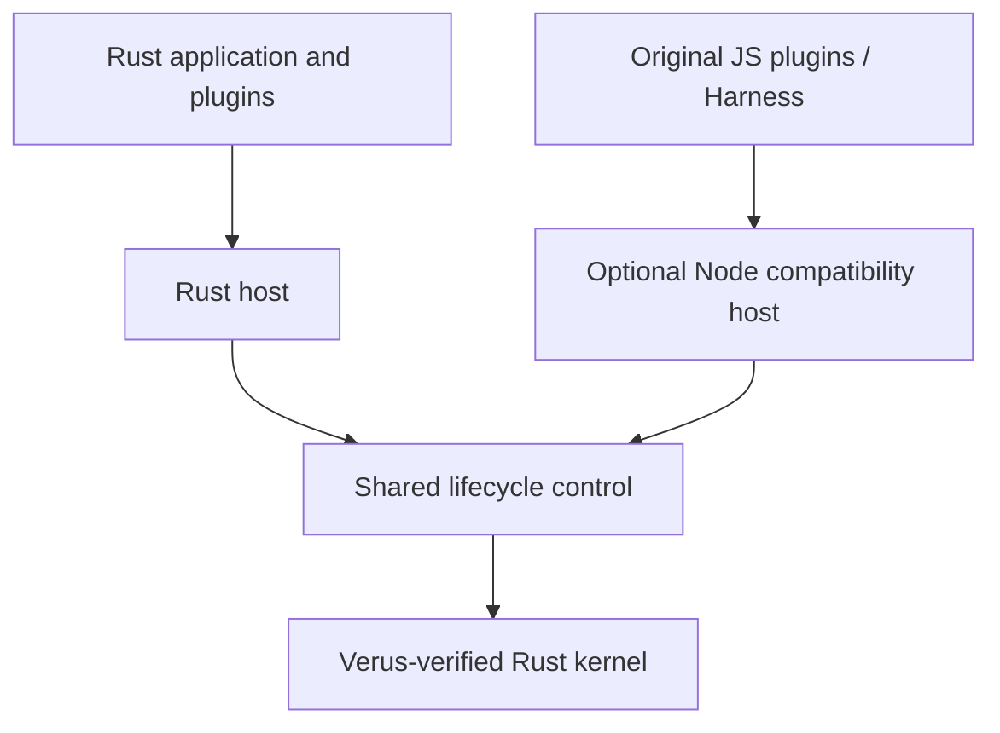

# cordis-verus

**A Rust implementation of Cordis with a Verus-verified lifecycle kernel.**

[简体中文](README.zh-CN.md) · [Documentation](docs/README.md) · [Examples](crates/cordis/examples) · [Roadmap](docs/roadmap.md) · [Contributing](CONTRIBUTING.md)

cordis-verus brings formal methods into a working plugin runtime. It implements [Cordis](https://github.com/cordiverse/cordis) lifecycles in Rust: plugins declare services and dependencies, and the runtime coordinates activation, provider changes and cleanup. The same kernel source is verified by [Verus](https://github.com/verus-lang/verus) and compiled into the application.

Build native Rust plugin systems, or use the optional Node host to run supported original Cordis plugins and compose Rust and JavaScript together. The companion [Cordis Harness](https://github.com/validation-engineering/cordis-harness) runs official DeepSeek Harness workflows on this runtime.

**Experimental, pre-1.0.** APIs are evolving; crates and npm packages are not yet published.

## Why cordis-verus

- **Verified lifecycle decisions.** Explicit contracts govern provider identity, activation and cleanup. A consumer keeps the services it needs until its cleanup completes; the Node host retains failed cleanup for explicit retry.
- **Reviewable from paper to code.** Follow paper definitions through assumptions, executable contracts and named regressions. The review paths distinguish proved results, conditional models and counterexamples.
- **Cordis functionality in Rust.** Compose typed services, asynchronous plugins and owned resources. Original plugin interfaces, upstream tests and official Harness workflows provide concrete targets for functional alignment.

## Quick start

This Rust example needs no Node, model credentials or external service. Prepare Git, Rustup, Python 3.9+, curl and a native Rust build toolchain. The source and checksum-locked toolchain archives are public; see the [setup notes](CONTRIBUTING.md#toolchain-availability).

```sh
git clone https://github.com/validation-engineering/cordis-verus.git
cd cordis-verus
./scripts/install-verus.sh
bash -c 'source scripts/toolchain-env.sh && cargo run --locked -p cordis --example basic'
```

The [basic example](crates/cordis/examples/basic.rs) mounts a consumer before its provider, then shuts them down:

```text
consumer: hello from verified Cordis
consumer cleanup still sees: hello from verified Cordis
provider cleanup follows the consumer
```

The consumer can still use its service during cleanup. The provider is released afterwards. For existing JavaScript plugins, follow the separate [Node setup and example](docs/node-compatibility.md).

## Architecture



**Pure Rust applications do not require Node or npm.** The optional Node layer preserves JavaScript values and interfaces while the Rust kernel makes lifecycle decisions. Both hosts manage their own callbacks, scheduling and resources.

Verus checks the kernel during development; a compiled application does not run the verifier. Full repository checks also exercise the Node host and therefore need Node. See the [architecture guide](docs/architecture.md) for crate boundaries, process plugins and the current Node-hosted Rust dynamic-library loader.

## Verification and compatibility

The semantic reference is [A Programming Paradigm for Spatiotemporal Composability](https://arxiv.org/abs/2608.25512v1). Verus checks the kernel's specified contracts under their stated assumptions. Ordinary hosts, arbitrary plugin callbacks, asynchronous scheduling, FFI and external I/O have separate test evidence. Full host-to-paper refinement remains open.

Original plugins and official Harness workflows test functional alignment against pinned upstream versions. Known gaps and deliberate lifecycle differences are documented; compatibility with every Cordis plugin is not established.

Choose a starting point for review:

- [Paper-to-code guide](docs/paper-review-guide.md): trace a claim to its contract, executable call and regression.
- [Comparison with Cordis](docs/comparison.md): see supported functionality and known differences.
- [Lifecycle cleanup case](docs/cases/lifecycle-cleanup.md): reproduce a consumer's final write while its provider remains available.

The [evidence guide](docs/evidence-guide.md) links source-bound proof, test and application records, with instructions for independent reproduction.

## Project status and roadmap

The project has an executable verified kernel, Rust and Node plugin hosts, and a companion application exercising official Harness workflows. Current work focuses on:

1. **Broader refinement:** connect more lifecycle behavior and host execution to the paper's constraints.
2. **Closer compatibility:** resolve known differences where alignment is intended and test more original plugins.
3. **Reproducible releases:** complete full platform validation and publish precompiled runtime assets through the [GitHub Release installation path](docs/native-distribution.md). Runtime releases are not yet available.

See the [roadmap](docs/roadmap.md) for acceptance criteria and the [paper ledger](docs/paper-coverage.md) for individual claims. Complete paper refinement and production readiness are still future work.

## Documentation and contributing

| Explore | Start here |
| --- | --- |
| Write Rust plugins | [Runtime guide](docs/runtime.md) · [Examples](crates/cordis/examples) |
| Use original plugins or mix Rust and JS | [Node compatibility](docs/node-compatibility.md) · [Rust plugin adapters](docs/rust-node-plugins.md) |
| Diagnose lifecycle waits | [Host diagnostics](docs/host-diagnostics.md) |
| Build an agent application | [Cordis Harness](https://github.com/validation-engineering/cordis-harness) |
| Review proofs or reproduce checks | [Paper review](docs/paper-review-guide.md) · [Validation](docs/validation.md) |

The [documentation index](docs/README.md) includes configuration, module reloads and other advanced topics. English and Chinese contributions are welcome; see [CONTRIBUTING.md](CONTRIBUTING.md) for development setup and [SECURITY.md](SECURITY.md) for vulnerability reporting.

Part of [Validation Engineering](https://github.com/validation-engineering): connecting specifications, executable code and reproducible evidence.

## License

[MIT](LICENSE), with upstream attribution in [NOTICE](NOTICE). An independent implementation, not an official Cordis or DeepSeek release. The reference paper is not redistributed; see [research inputs](reference/README.md).
