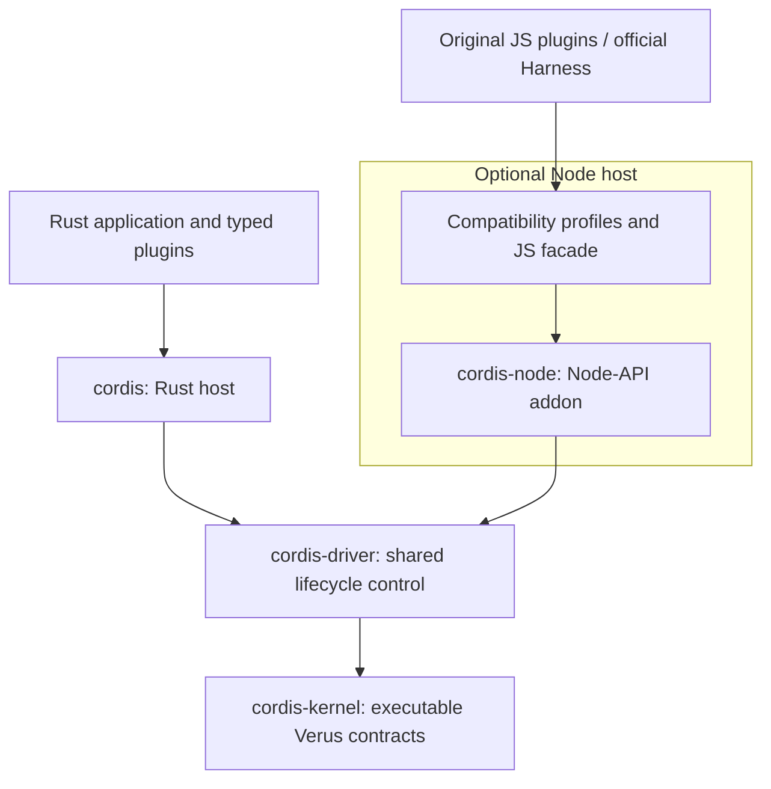

# cordis-verus

**A Rust plugin runtime with a Verus-verified lifecycle kernel.**

[简体中文](README.zh-CN.md) · [Documentation](docs/README.md) · [Examples](crates/cordis/examples) · [Roadmap](docs/roadmap.md) · [Contributing](CONTRIBUTING.md)

cordis-verus implements [Cordis](https://github.com/cordiverse/cordis) plugin lifecycles and reversible effects in Rust. Plugins declare services and dependencies; the runtime coordinates activation, provider changes, and cleanup. The kernel is executable Rust: the same source is verified by [Verus](https://github.com/verus-lang/verus) and compiled by Cargo.

The project connects formal methods to running software while aligning with Cordis functionality. Follow the [paper-to-code review paths](docs/paper-review-guide.md) to inspect lifecycle contracts, or explore [functional alignment](docs/comparison.md) through original plugins and official Harness workflows.

Use it to build Rust plugin systems, host supported Cordis JavaScript plugins through a native Node adapter, or compose Rust and JavaScript plugins in one lifecycle graph.

**Status:** Experimental, pre-1.0. APIs are evolving, and the crates and npm packages are not yet published. See [current progress and next steps](#current-progress-and-next-steps) for remaining work, and [verification scope](#verification-scope) for the distinction between kernel proofs, runtime tests, and application compatibility.

Part of [Validation Engineering](https://github.com/validation-engineering): connecting specifications, executable code, and reproducible evidence. Start with the [evidence guide](docs/evidence-guide.md) for paper-to-code review paths, supported Cordis functionality, and a runnable lifecycle case.

## Features

- **Dependency-aware lifecycles.** Track provider identity and retain the services an active consumer needs until its cleanup completes. Failed cleanup remains visible and retains the resources needed for recovery.
- **Typed Rust plugins.** Compose services, asynchronous setup and cleanup, child plugins, events, and timers with explicit resource ownership.
- **Cordis on Node.** Run supported original JS plugins with Rust making lifecycle decisions. JavaScript objects, functions, and service values retain their identity in Node. Cordis and DeepSeek Harness have separate compatibility profiles.
- **Rust and JavaScript together.** Mount user-compiled Rust plugins in the Node graph through explicit service, stream, object, and callback adapters. Typed bindings preserve existing Rust service slots, with opt-in dynamic publications, owned child plugins, live values and consumer-specific availability checks.
- **Reloadable native plugins.** Load independently built Rust `cdylib` plugins through a versioned C ABI, then replace their instances in the same Node process. Declared JS dependencies, bidirectional streams and objects, and dynamically published child factories share the same lifecycle graph. Opt-in versioned JSON checkpoints preserve logical state across reloads; failures can restore the previous code, configuration and checkpoint after real cleanup.
- **Configuration and reload.** Load JSON plugin trees and coordinate official Harness configuration edits and supported in-place module reloads through one lifecycle queue. Use captured Worker or OS-process artifacts when an isolated replacement is needed, with recovery after failed startup. External executable plugins use a separate JSON-RPC interface.

See [upstream parity](docs/upstream-parity.md) for supported behavior and deliberate differences, and [semantics](docs/semantics.md) for lifecycle contracts.

## Quick start

You need Git, Rustup, Python 3.9+, curl, and a native Rust build toolchain. The installer selects and checks the pinned Rust/Verus toolchain from [toolchain.lock.json](toolchain.lock.json); it does not change your default Rustup toolchain. Installer targets are macOS ARM64/x86_64 and Linux x86_64.

```sh
git clone https://github.com/validation-engineering/cordis-verus.git
cd cordis-verus
./scripts/install-verus.sh
bash -c 'source scripts/toolchain-env.sh && cargo run --locked -p cordis --example basic'
```

Repository access is currently required to clone. Initial setup downloads the toolchain and dependencies. The example needs no model credentials or external service.

The [basic example](crates/cordis/examples/basic.rs) mounts a consumer before its provider, then shuts them down:

```text
consumer: hello from verified Cordis
consumer cleanup still sees: hello from verified Cordis
provider cleanup follows the consumer
```

The consumer can still use its committed service during cleanup. The provider is released afterwards. The example includes a small executor; the Rust runtime itself does not select an async executor for your application.

### Node compatibility (optional)

With the Rust toolchain installed, use Node **22.22.0** and npm:

```sh
npm ci --ignore-scripts
npm run build:native
npm run example:node
```

The [Node example](examples/node/basic.mjs) imports `Context` from `cordis`, loads a service, and disposes its consumers. A preload hook routes that package name to the native adapter. For your own application, select the matching profile:

```sh
# Original Cordis plugins
node --import @cordis-verus/compat-cordis/register app.mjs

# DeepSeek Harness Cordis plugins
node --import @cordis-verus/compat-harness/register app.mjs
```

These commands require the corresponding local runtime packages. Compile TypeScript plugins to JavaScript before loading them. Use one profile per Node environment. Compatibility is validated for specific interfaces and applications; see the [Node guide](docs/node-compatibility.md) for loading rules, known differences, and platform limits.

### DeepSeek Harness

The companion [cordis-harness](https://github.com/validation-engineering/cordis-harness) project exercises this runtime in an application. It runs the pinned official **Web / standard** and **headless** compositions, preserving the official CLI, Loader, plugins, frontend, and JSONL session storage while replacing the **Node Cordis host**. Browser-side Cordis remains the official JavaScript implementation.

Follow its [build guide](https://github.com/validation-engineering/cordis-harness/blob/main/docs/build.md) to prepare the verified runtime artifacts. Then, from that repository:

```sh
npm run official:install -- --offline
npm run official
```

Use the install command without `--offline` when public dependencies are not cached. The [application acceptance record](https://github.com/validation-engineering/cordis-harness/blob/main/docs/official-validation-report.json) covers the default plugin roster, a real tool call, session recovery across processes, and shutdown. Model requests in acceptance tests use a local fixture; interactive use requires your own model configuration.

## Architecture

**Node is optional.** Rust applications use `cordis` directly, with no Node or npm dependency. The Node host is a separate integration layer for supported original Cordis JS/TS plugins, official Harness workflows, and mixed Rust/JS applications.



The arrows summarize lifecycle call paths. The kernel governs lifecycle state; each host owns its values, callbacks, scheduling and resource journals. JavaScript values stay in Node, while the Rust kernel decides lifecycle transitions.

| Component | Responsibility and dependency scope |
| --- | --- |
| [`cordis-kernel`](crates/cordis-kernel) | Executable lifecycle, action-ownership and publication contracts; uses the pinned `vstd` library |
| [`cordis-driver`](crates/cordis-driver) | Shared lifecycle control over the kernel; ordinary Rust host code |
| [`cordis`](crates/cordis) | Rust application API: typed services, plugin callbacks, async work, events, timers and configuration; depends on the driver and kernel |
| [`cordis-node`](crates/cordis-node) and [`packages/`](packages) | Optional Node-API binding, JavaScript facades, compatibility profiles and Rust plugin adapters |
| [`cordis-plugin-api`](crates/cordis-plugin-api) | Node-independent SDK and versioned C ABI for separately built Rust plugins; the current dynamic-library loader is in `cordis-node` |

The workspace's default members are `cordis-kernel`, `cordis-driver` and `cordis`. Node support is selected through separate crates and packages. Rust plugins compiled into an application use the Rust API directly. The optional [process-plugin protocol](docs/process-plugins.md) runs external executables over JSON-RPC and requires only the runtime chosen by that plugin. Independently built Rust `cdylib` plugins currently load into the Node host; see the [native module guide](docs/native-rust-modules.md) for replacement and lifetime contracts.

| Usage | Requirements |
| --- | --- |
| Build and run a Rust application | Pinned Rust/Cargo and dependencies; repository setup scripts also prepare the pinned Verus toolchain. No Node or npm is needed. |
| Run original JS plugins or official Harness | Rust-backed native addon, compatible Node and JS dependencies; TypeScript plugins must first be compiled to JS. |
| Verify the kernel | Pinned Verus and its solver, using the same kernel source that Cargo compiles. |
| Run the complete repository development or release checks | Both Rust/Verus and Node/npm, because these checks also exercise the compatibility layer. |

Verus is a development-time verifier. A compiled Rust application runs the executable code without launching Verus or its solver. See the [architecture guide](docs/architecture.md) for source navigation, additional plugin paths and trust boundaries.

## Verification scope

Formal guarantees apply to explicit contracts and their stated assumptions. The same `cordis-kernel` source contains executable operations, specifications and proofs; Cargo compiles the executable parts into the runtime, while Verus checks their contracts. Proof-only definitions do not run as a separate lifecycle engine.

| Layer | Evidence and boundary |
| --- | --- |
| Executable kernel and verified closed program drivers | Verus checks invariants and postconditions under each function's `requires`, including provider identity, guarded cleanup and the supported recovery protocols. |
| Paper models and refinement bridges | Proofs connect specific definitions, projections and restricted execution models. Their premises and counterexamples remain explicit; this is not yet a complete proof of the paper or all host executions. |
| Shared driver, Rust/JS hosts and plugins | Behavior tests, unchanged upstream suites and Harness acceptance exercise integration. Arbitrary callbacks, asynchronous scheduling, FFI, dynamic libraries, process protocols and file/network I/O remain outside the completed formal proof. |

For example, the kernel contract can require provider resources to remain live until dependent consumers finish cleanup. The [lifecycle case](docs/cases/lifecycle-cleanup.md) tests that behavior with real JS callbacks and a file stream; it does not prove arbitrary file operations. Ordinary host callers must meet the kernel's preconditions, and a proof for a closed driver does not establish that correspondence for every host.

The assurance also relies on the specification matching the intended behavior, the pinned Verus/compiler/solver toolchain, and the execution platform. `--no-cheating` rejects proof bypasses such as `assume`, `admit` and `external_body`; it does not extend the proof boundary to external code. The [paper review guide](docs/paper-review-guide.md) makes these assumptions and executable call paths reviewable.

The last recorded local development run includes:

| Check | Result |
| --- | ---: |
| Whole-kernel Verus verification, with `--no-cheating --compile` | Source-bound proof counts in the [development report](docs/development-report.json) |
| Rust, documentation, and Node behavior tests | Source-bound counts in the [development report](docs/development-report.json) |
| Extracted crate builds and npm installation checks | Passed on macOS ARM64 / Node 22.22.0 |

The [development report](docs/development-report.json) binds results to source and artifact hashes. These are verification obligations and tests, not a count of proved paper theorems. Other platforms require their own execution evidence.

The semantic reference is [arXiv:2608.25512v1](https://arxiv.org/abs/2608.25512v1). Full host-to-paper refinement and the complete release gate remain open. The [paper ledger](docs/paper-coverage.md) records completed, partial, and refuted claims; the [paper audit](docs/paper-audit.md) explains their scope. A passing development run does not substitute for the release gate's full negative-control suite.

## Current progress and next steps

Status overview as of **2026-10-07**. Results below refer to the linked source-bound snapshots; implementation progress, formal proof coverage and application acceptance are tracked separately.

| Area | Current progress | Remaining scope |
| --- | --- | --- |
| Executable lifecycle kernel | The same Rust source is verified by Verus and compiled into the runtime; [development evidence](docs/development-report.json) covers local proofs, tests and package checks. | General host refinement, including asynchronous callbacks, FFI and external I/O, remains open. |
| Paper correspondence | The [81-item ledger](docs/paper-coverage.md) records 42 `formalized`, 17 `proved`, 18 `partial` and 4 `refuted` items. | Four integration obligations remain open. A formalized definition is not a proved theorem; refuted original claims retain their counterexamples. |
| Cordis functional alignment | Rust and Node plugin paths, two compatibility profiles, configuration updates and supported reload mechanisms are implemented. The [archived core comparison](docs/evidence/README.md) records upstream 87/87 and native 83/87. | Two intentional contract differences and two compatibility gaps remain; broader third-party plugin coverage needs validation. |
| Application integration | The companion [Harness acceptance](https://github.com/validation-engineering/cordis-harness/blob/main/docs/official-validation-report.json) covers pinned official Web/standard and headless workflows with JS/Rust extensions. | This is application test evidence. Cross-platform acceptance and a full release gate are still pending. |

The next priorities are:

1. **Restore reproducible setup and CI.** Establish a durable source for the pinned Verus archives, preserving their versions and checksums. The [recorded CI failure](https://github.com/validation-engineering/cordis-verus/actions/runs/37490393141) occurred because the old rolling-release assets returned HTTP 404.
2. **Close the identified compatibility gaps.** Align consecutive provider/consumer update coalescing and the error contract for resource registration during cleanup, then rerun the unchanged upstream suites and Harness acceptance. Keep deliberate lifecycle differences documented.
3. **Extend paper-to-code refinement.** Work through the four integration obligations, including whole-lifecycle behavior, corrected specification, executable simulation and host boundaries. Preserve the distinction between original claims, counterexamples and revised results.
4. **Complete release evidence.** Finish the full-crate negative-control gate and actual platform-specific builds and application runs, then prepare package publication and independent reproductions.

The [roadmap](docs/roadmap.md) gives detailed deliverables and acceptance criteria, including remaining typed Rust interfaces and module-reload boundaries. These are priorities, not scheduled releases; full paper refinement and production readiness are not yet claimed.

## Development

After installing the toolchain and Node dependencies:

```sh
# Proofs, formatting, lints, docs, tests, examples, and package checks
python3 scripts/record-development.py

# Check that recorded evidence still matches local sources and artifacts
python3 scripts/record-development.py --check
```

Add `--offline` to the first command when dependencies are cached. The second command checks freshness; it does not rerun proofs. Upstream differential tests and the complete release gate are separate checks described in [validation](docs/validation.md) and the [Node guide](docs/node-compatibility.md).

## Documentation and contributing

| Topic | Guide |
| --- | --- |
| Rust services and resource ownership | [Runtime](docs/runtime.md) · [Events](docs/events.md) |
| Configuration and external plugins | [Loader](docs/loader.md) · [Process plugins](docs/process-plugins.md) |
| Original JS plugins and native packages | [Node compatibility](docs/node-compatibility.md) · [Distribution](docs/native-distribution.md) |
| Rust plugins in a Node application | [Factory SDK](docs/rust-node-plugins.md) · [Typed bindings](docs/typed-rust-plugins.md) · [Native module reload](docs/native-rust-modules.md) |
| Proofs, progress, and remaining work | [Refinement](docs/refinement.md) · [Status](docs/status.md) · [Roadmap](docs/roadmap.md) |

The [documentation index](docs/README.md) includes further examples and design notes. Detailed documentation is currently a mix of English and Chinese.

Bug reports, focused fixes, plugin compatibility cases, and proof contributions are welcome in either language. Read [CONTRIBUTING.md](CONTRIBUTING.md) for setup and review expectations, [SECURITY.md](SECURITY.md) for vulnerability reporting, and the [release procedure](docs/releasing.md) for publication requirements.

## License

[MIT](LICENSE). Upstream components retain their licenses and attribution in [NOTICE](NOTICE). cordis-verus is an independent implementation, not an official Cordis or DeepSeek release. The reference paper and extracted text are not distributed with this repository; see [research inputs](reference/README.md).
