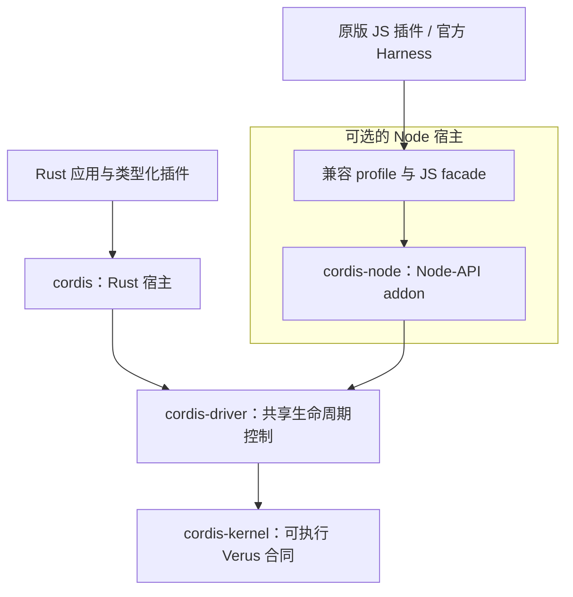

# cordis-verus

**以 Verus 验证生命周期内核的 Rust 插件运行时。**

[English](README.md) · [文档](docs/README.md) · [示例](crates/cordis/examples) · [路线图](docs/roadmap.md) · [参与贡献](CONTRIBUTING.md)

cordis-verus 用 Rust 实现 [Cordis](https://github.com/cordiverse/cordis) 的插件生命周期与可逆效果。插件声明服务和依赖，运行时协调激活、提供者变化和清理。内核是可执行的 Rust：同一份源码接受 [Verus](https://github.com/verus-lang/verus) 验证，并由 Cargo 编译。

项目的主线是将形式化方法落实到运行代码，同时对齐 Cordis 功能。通过[论文到代码的审查路径](docs/paper-review-guide.zh-CN.md)检查生命周期合同，通过原版插件和官方 Harness 工作流检验[功能对齐](docs/comparison.zh-CN.md)。

你可以用它构建 Rust 插件系统，通过原生 Node 适配器运行支持范围内的 Cordis JavaScript 插件，或将 Rust 与 JavaScript 插件组合到同一个生命周期图中。

**项目状态：** 实验性、尚未达到 1.0。API 仍在演进，crate 和 npm 包尚未发布。剩余工作见[当前进度与后续计划](#当前进度与后续计划)，内核证明、运行时测试与应用兼容性各自的范围见[验证范围](#验证范围)。

本项目属于 [Validation Engineering](https://github.com/validation-engineering)，连接规格、执行代码与可复现证据。从[证据指南](docs/evidence-guide.md)进入论文到代码的审查路径、Cordis 功能对齐与实际清理案例。

## 功能

- **依赖感知的生命周期。** 跟踪服务提供者的实际身份，直到消费者完成清理后才释放其依赖的服务。清理失败会明确报告，并保留恢复所需的资源。
- **类型化 Rust 插件。** 组合服务、异步初始化与清理、子插件、事件和定时器，显式管理资源所有权。
- **在 Node 中运行 Cordis。** 由 Rust 决定生命周期动作，运行支持范围内的原版 JS 插件。JavaScript 对象、函数和服务值保留在 Node 中，保持原有身份。Cordis 与 DeepSeek Harness 使用不同的兼容 profile。
- **组合 Rust 与 JavaScript。** 用户编译的 Rust 插件可通过显式服务、流、对象和回调适配器加入 Node 图；typed binding 保留既有 Rust 服务槽，并可显式开启动态 publication、拥有的子插件、动态值与按 consumer 检查 availability。
- **可热替换的原生插件。** 通过版本化 C ABI 加载独立构建的 Rust `cdylib`，在同一 Node 进程内替换插件实例。声明式 JS 依赖、双向流和对象、动态发布的子插件 factory 共用同一生命周期图；显式版本化 JSON checkpoint 可在换代时保留业务状态；失败后等待真实清理，再恢复旧代码、配置和快照。
- **配置与重载。** 加载 JSON 插件树，并通过同一生命周期队列协调官方 Harness 配置编辑与支持范围内的原地模块重载。需要隔离替换时，使用捕获的 Worker 或进程制品，启动失败时恢复旧版本。外部可执行插件使用独立 JSON-RPC 接口。

支持行为和有意保留的差异见[上游对照](docs/upstream-parity.md)，生命周期契约见[语义说明](docs/semantics.md)。

## 快速开始

需要 Git、Rustup、Python 3.9+、curl 和本机 Rust 编译工具链。安装脚本按照 [toolchain.lock.json](toolchain.lock.json) 选择并校验固定的 Rust/Verus 工具链，不修改 Rustup 默认工具链。安装器支持 macOS ARM64/x86_64 和 Linux x86_64。

```sh
git clone https://github.com/validation-engineering/cordis-verus.git
cd cordis-verus
./scripts/install-verus.sh
bash -c 'source scripts/toolchain-env.sh && cargo run --locked -p cordis --example basic'
```

仓库目前需要相应访问权限才能克隆。首次准备需要下载工具链和依赖；示例本身不需要模型凭据或外部服务。

[基础示例](crates/cordis/examples/basic.rs) 先挂载消费者，再挂载提供者，最后执行清理：

```text
consumer: hello from verified Cordis
consumer cleanup still sees: hello from verified Cordis
provider cleanup follows the consumer
```

消费者在清理期间仍能使用当前生命周期已经取得的服务，提供者随后才被释放。示例自带一个小型 executor；Rust 运行时不替应用选择异步 executor。

### Node 兼容层（可选）

安装 Rust 工具链后，使用 Node **22.22.0** 和 npm：

```sh
npm ci --ignore-scripts
npm run build:native
npm run example:node
```

[Node 示例](examples/node/basic.mjs) 从 `cordis` 导入 `Context`，加载服务并清理消费者。预加载 hook 将这个包名映射到原生适配器。自己的应用应选择对应的 profile：

```sh
# 原版 Cordis 插件
node --import @cordis-verus/compat-cordis/register app.mjs

# DeepSeek Harness Cordis 插件
node --import @cordis-verus/compat-harness/register app.mjs
```

这些命令要求已安装对应的本地 runtime 包。TypeScript 插件需先编译为 JavaScript；同一 Node environment 使用一个 profile。兼容性按具体接口和应用验证，加载规则、已知差异与平台限制见 [Node 指南](docs/node-compatibility.md)。

### DeepSeek Harness

配套项目 [cordis-harness](https://github.com/validation-engineering/cordis-harness) 在实际应用中验证这个运行时。它运行固定官方版本的 **Web / standard** 和 **headless** 组合，保留官方 CLI、Loader、插件、前端与 JSONL 会话存储，替换其中的 **Node Cordis 宿主**。浏览器端 Cordis 仍为官方 JavaScript 实现。

按配套项目的[构建指南](https://github.com/validation-engineering/cordis-harness/blob/main/docs/build.md) 准备已验收的 runtime 制品，然后在该仓库运行：

```sh
npm run official:install -- --offline
npm run official
```

没有公开依赖缓存时，安装命令去掉 `--offline`。[应用验收记录](https://github.com/validation-engineering/cordis-harness/blob/main/docs/official-validation-report.json) 覆盖默认插件清单、真实工具调用、跨进程会话恢复和关闭。验收中的模型请求使用本机 fixture；交互使用需自行配置模型。

## 架构

**Node 是可选依赖。** Rust 应用可直接使用 `cordis`，无需 Node 或 npm。Node 宿主是独立的集成层，用于支持范围内的原版 Cordis JS/TS 插件、官方 Harness 工作流，以及 Rust/JS 混合应用。



箭头概括生命周期调用路径。内核管理生命周期状态，各宿主拥有自己的值、回调、调度与资源日志。JavaScript 值保留在 Node 中，生命周期转换由 Rust 内核决定。

| 组件 | 职责与依赖范围 |
| --- | --- |
| [`cordis-kernel`](crates/cordis-kernel) | 可执行的生命周期、动作所有权和服务发布合同；使用锁定版本的 `vstd` 库 |
| [`cordis-driver`](crates/cordis-driver) | 基于内核的共享生命周期控制；属于普通 Rust 宿主代码 |
| [`cordis`](crates/cordis) | Rust 应用 API：类型化服务、插件回调、异步工作、事件、定时器与配置；依赖 driver 和 kernel |
| [`cordis-node`](crates/cordis-node) 和 [`packages/`](packages) | 可选的 Node-API 绑定、JavaScript facade、兼容 profile 与 Rust 插件适配器 |
| [`cordis-plugin-api`](crates/cordis-plugin-api) | 不依赖 Node 的独立 Rust 插件 SDK 与版本化 C ABI；当前动态库加载器位于 `cordis-node` |

workspace 的默认成员是 `cordis-kernel`、`cordis-driver` 和 `cordis`。Node 支持通过独立 crate 和包接入。随应用一起编译的 Rust 插件直接使用 Rust API。可选的[进程插件协议](docs/process-plugins.md)通过 JSON-RPC 运行外部可执行文件，只要求该插件自身选用的运行环境。独立构建的 Rust `cdylib` 目前加载到 Node 宿主中，替换和生命周期合同见[原生模块指南](docs/native-rust-modules.md)。

| 用途 | 环境要求 |
| --- | --- |
| 构建并运行 Rust 应用 | 锁定的 Rust/Cargo 与依赖；仓库准备脚本还会安装锁定的 Verus 工具链。无需 Node 或 npm。 |
| 运行原版 JS 插件或官方 Harness | Rust 原生 addon、兼容的 Node 与 JS 依赖；TypeScript 插件须先编译为 JS。 |
| 验证内核 | 锁定的 Verus 及其求解器，验证的内核源码与 Cargo 编译的是同一份。 |
| 执行完整仓库开发检查或发布检查 | Rust/Verus 和 Node/npm 均需准备，因为检查也覆盖兼容层。 |

Verus 是开发阶段的验证器。已编译的 Rust 应用直接运行可执行代码，无需启动 Verus 或其求解器。源码导航、其他插件路径与信任边界见[架构指南](docs/architecture.md)。

## 验证范围

形式化保证适用于明确写出的合同及其前提。同一份 `cordis-kernel` 源码包含可执行操作、规范与证明：Cargo 将可执行部分编译进运行时，Verus 检查相应合同。仅用于证明的定义不会作为另一套生命周期引擎运行。

| 层次 | 证据与边界 |
| --- | --- |
| 可执行内核与已验证的闭合程序驱动 | Verus 在各函数的 `requires` 下检查不变式与后置条件，包括 provider 身份、受守卫约束的清理和支持范围内的恢复协议。 |
| 论文模型与 refinement 桥接 | 证明连接具体定义、投影与受限执行模型；前提和反例均明确保留，尚未构成整篇论文或所有宿主执行的完整证明。 |
| 共享 driver、Rust/JS 宿主与插件 | 行为测试、未经修改的上游套件和 Harness 验收检查集成；任意回调、异步调度、FFI、动态库、进程协议及文件／网络 I/O 仍在已完成的形式证明范围之外。 |

例如，内核合同可要求 provider 的资源保持有效，直到依赖它的消费者完成清理。[生命周期案例](docs/cases/lifecycle-cleanup.md)使用真实 JS 回调与文件流检验这一行为，但不证明任意文件操作。普通宿主调用者仍需满足内核前置条件；闭合驱动的证明不会自动建立每个宿主到这些合同的对应关系。

这些保证还依赖规范符合预期行为、锁定的 Verus／编译器／求解器工具链以及执行平台。`--no-cheating` 禁止 `assume`、`admit`、`external_body` 等证明绕过方式，但不会将外部代码纳入证明范围。[论文审查指南](docs/paper-review-guide.zh-CN.md)提供了检查这些前提与实际执行路径的入口。

最近一次记录的本机开发检查包括：

| 检查 | 结果 |
| --- | ---: |
| Verus 全库验证，使用 `--no-cheating --compile` | 以[开发报告](docs/development-report.json)中绑定源码的证明结果为准 |
| Rust、文档与 Node 行为测试 | 精确数量见绑定源码的[开发记录](docs/development-report.json) |
| 解包后的 crate 构建与 npm 安装检查 | 在 macOS ARM64 / Node 22.22.0 通过 |

[开发记录](docs/development-report.json) 将结果绑定到源码和制品哈希。这些数字是验证义务和测试数量，不是已证明的论文定理数量；其他平台需要各自的执行证据。

语义参考为 [arXiv:2608.25512v1](https://arxiv.org/abs/2608.25512v1)。完整宿主到论文的 refinement 和完整发布门槛仍未完成。[论文清单](docs/paper-coverage.md) 记录已完成、部分完成和已反驳的条目，[论文审计](docs/paper-audit.md) 解释具体范围。开发检查通过不能替代发布门槛中的完整负控测试。

## 当前进度与后续计划

以下为 **2026-10-07** 的进度概览。验证结果对应所链接的源码绑定快照；实现进度、形式化证明覆盖和应用验收分别记录。

| 方向 | 当前进度 | 尚未完成的范围 |
| --- | --- | --- |
| 可执行生命周期内核 | 同一份 Rust 源码接受 Verus 验证并编译进入运行时；[开发证据](docs/development-report.json)覆盖本机证明、测试和包检查。 | 包括异步回调、FFI 与外部 I/O 在内的一般宿主 refinement 仍未完成。 |
| 论文对应 | [81 项清单](docs/paper-coverage.md)记录 42 项 `formalized`、17 项 `proved`、18 项 `partial`、4 项 `refuted`。 | 另有 4 项整体连接义务开放。定义形式化不等于定理证明；已反驳的原文主张保留其反例。 |
| Cordis 功能对齐 | 已实现 Rust 与 Node 插件路径、两种兼容 profile、配置更新和支持范围内的重载机制。[已归档核心对比](docs/evidence/README.md)为 upstream 87/87、native 83/87。 | 仍有两项有意合同差异和两项兼容缺口；更多第三方插件还需验证。 |
| 应用集成 | 配套 [Harness 验收](https://github.com/validation-engineering/cordis-harness/blob/main/docs/official-validation-report.json)覆盖固定官方 Web/standard、headless 工作流及 JS/Rust 扩展。 | 这是应用测试证据；跨平台验收和完整发布门槛尚未完成。 |

接下来优先推进：

1. **恢复可复现安装与 CI。** 为锁定的 Verus 包建立长期可用的下载来源，保留版本和校验值。[已记录的 CI 失败](https://github.com/validation-engineering/cordis-verus/actions/runs/37490393141)源于旧 rolling release 资产返回 HTTP 404。
2. **补齐已识别的兼容缺口。** 对齐连续 provider/consumer 更新的合并语义，以及清理期间注册资源的错误合同，随后重跑未经修改的上游套件与 Harness 验收。有意保留的生命周期差异继续明确记录。
3. **扩大论文到代码的 refinement。** 推进完整生命周期、修正规范、可执行模拟和宿主边界等 4 项整体连接义务，持续区分原文主张、反例与修订结论。
4. **完成发布证据。** 完成全库负控门槛与各目标平台的实际构建、应用运行，再准备包发布和独立复现。

[路线图](docs/roadmap.md)列出详细交付物与验收条件，包括剩余 typed Rust 接口和模块重载边界。这些是工作优先级，不是已承诺的发布日期；完整论文 refinement 和生产就绪尚未宣称完成。

## 开发与验证

安装工具链和 Node 依赖后：

```sh
# 证明、格式、lint、文档、测试、示例与打包检查
python3 scripts/record-development.py

# 检查已有记录是否仍与本地源码和制品匹配
python3 scripts/record-development.py --check
```

依赖已缓存时，可给第一条命令加 `--offline`。第二条命令只检查记录是否过期，不重新执行证明。上游差分测试和完整发布门槛是独立检查，使用方式见[验证说明](docs/validation.md)和 [Node 指南](docs/node-compatibility.md)。

## 文档与贡献

| 主题 | 指南 |
| --- | --- |
| Rust 服务与资源所有权 | [Runtime](docs/runtime.md) · [Events](docs/events.md) |
| 配置与外部插件 | [Loader](docs/loader.md) · [Process plugins](docs/process-plugins.md) |
| 原版 JS 插件与原生包 | [Node compatibility](docs/node-compatibility.md) · [Distribution](docs/native-distribution.md) |
| Node 应用中的 Rust 插件 | [Factory SDK](docs/rust-node-plugins.md) · [Typed bindings](docs/typed-rust-plugins.md) · [Native module reload](docs/native-rust-modules.md) |
| 证明、进度与后续工作 | [Refinement](docs/refinement.md) · [Status](docs/status.md) · [Roadmap](docs/roadmap.md) |

更多示例与设计说明见[文档导航](docs/README.md)。专题文档目前包含英文和中文两种语言。

欢迎提交缺陷报告、小范围修复、插件兼容用例和证明贡献，中英文均可。环境与评审要求见 [CONTRIBUTING.md](CONTRIBUTING.md)，安全问题报告见 [SECURITY.md](SECURITY.md)，发布要求见[发布流程](docs/releasing.md)。

## 许可

采用 [MIT](LICENSE) 许可。上游组件保留各自许可证，来源声明见 [NOTICE](NOTICE)。cordis-verus 是独立实现，不是 Cordis 或 DeepSeek 官方发行版。参考论文和提取文本不随仓库分发，详见[研究输入](reference/README.md)。
