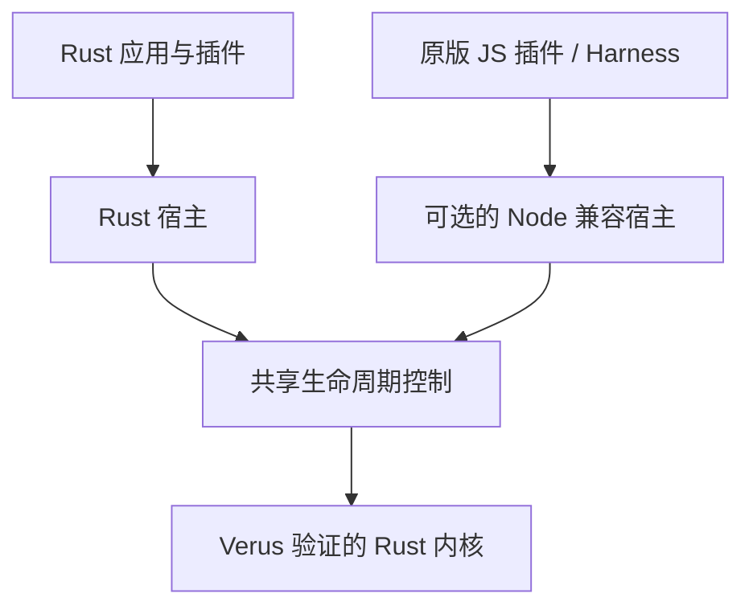

# cordis-verus

**以 Verus 验证生命周期内核的 Cordis Rust 实现。**

[English](README.md) · [文档](docs/README.md) · [示例](crates/cordis/examples) · [路线图](docs/roadmap.md) · [参与贡献](CONTRIBUTING.md)

cordis-verus 将形式化方法落实到实际运行的插件系统。它用 Rust 实现 [Cordis](https://github.com/cordiverse/cordis) 生命周期：插件声明服务与依赖，运行时协调激活、提供者变化和清理。同一份内核源码接受 [Verus](https://github.com/verus-lang/verus) 验证，并编译进入应用。

你可以构建原生 Rust 插件系统，也可以通过可选的 Node 宿主运行支持范围内的原版 Cordis 插件，将 Rust 与 JavaScript 组合使用。配套项目 [Cordis Harness](https://github.com/validation-engineering/cordis-harness) 在这个运行时上运行官方 DeepSeek Harness 工作流。

**实验性、尚未达到 1.0。** API 仍在演进，crate 和 npm 包尚未发布。

## 为什么使用 cordis-verus

- **经过验证的生命周期决策。** 显式合同约束 provider 身份、激活与清理。消费者在清理完成前保留所需服务；Node 宿主保留失败的清理动作，支持显式重试。
- **从论文到代码的审查路径。** 沿论文定义检查前提、可执行合同与具名回归测试，区分已经证明的结果、条件化模型和反例。
- **Rust 中的 Cordis 功能。** 组合类型化服务、异步插件与具有明确所有者的资源。原版插件接口、上游测试和官方 Harness 工作流为功能对齐提供具体目标。

## 快速开始

这个 Rust 示例不需要 Node、模型凭据或外部服务。请准备 Git、Rustup、Python 3.9+、curl 和本机 Rust 编译工具链。源码仓库与经过校验和锁定的工具链归档均已公开，详见[环境准备说明](CONTRIBUTING.md#toolchain-availability)。

```sh
git clone https://github.com/validation-engineering/cordis-verus.git
cd cordis-verus
./scripts/install-verus.sh
bash -c 'source scripts/toolchain-env.sh && cargo run --locked -p cordis --example basic'
```

[基础示例](crates/cordis/examples/basic.rs) 先挂载消费者，再挂载提供者，最后执行清理：

```text
consumer: hello from verified Cordis
consumer cleanup still sees: hello from verified Cordis
provider cleanup follows the consumer
```

消费者在清理期间仍能使用其服务，提供者随后才被释放。已有 JavaScript 插件的使用方式见独立的 [Node 安装与示例指南](docs/node-compatibility.md)。

## 架构



**纯 Rust 应用不依赖 Node 或 npm。** 可选的 Node 层保留 JavaScript 值与接口，由 Rust 内核决定生命周期动作。两个宿主各自管理回调、调度和资源。

Verus 在开发阶段检查内核，已编译应用无需运行验证器。完整仓库检查也会覆盖 Node 宿主，因此需要 Node。crate 边界、进程插件和当前由 Node 宿主加载的 Rust 动态库，详见[架构指南](docs/architecture.md)。

## 验证与兼容性

语义参考是 [A Programming Paradigm for Spatiotemporal Composability](https://arxiv.org/abs/2608.25512v1)。Verus 在明确的前提下检查内核合同。普通宿主、任意插件回调、异步调度、FFI 和外部 I/O 使用独立的测试证据，完整的宿主到论文 refinement 仍未完成。

原版插件与官方 Harness 工作流用于检验固定上游版本的功能对齐。已知缺口和有意保留的生命周期差异均有记录，尚未建立对所有 Cordis 插件的兼容性。

可以从以下入口开始审查：

- [论文到代码指南](docs/paper-review-guide.zh-CN.md)：从一项主张追踪到合同、实际调用和回归测试。
- [Cordis 功能对照](docs/comparison.zh-CN.md)：了解支持的功能与已知差异。
- [生命周期清理案例](docs/cases/lifecycle-cleanup.md)：复现消费者在 provider 仍可用时写入最后一条记录。

[证据指南](docs/evidence-guide.md) 汇集绑定源码的证明、测试和应用验收记录，以及独立复现方式。

## 项目进度与路线图

项目已有可执行的已验证内核、Rust 与 Node 插件宿主，以及运行官方 Harness 工作流的配套应用。后续工作聚焦：

1. **扩大 refinement：** 将更多生命周期行为与宿主执行连接到论文约束。
2. **完善兼容性：** 修复需要对齐的已知差异，验证更多原版插件。
3. **准备可复现发布：** 完成全部平台的发布验收，通过 [GitHub Release 安装路径](docs/native-distribution.zh-CN.md)提供预编译运行产物；当前尚无可下载的 runtime release。

具体验收条件见[路线图](docs/roadmap.md)，逐项主张见[论文清单](docs/paper-coverage.md)。完整论文 refinement 与生产就绪仍是后续目标。

## 文档与贡献

| 用途 | 入口 |
| --- | --- |
| 编写 Rust 插件 | [运行时指南](docs/runtime.md) · [示例](crates/cordis/examples) |
| 使用原版插件或混合 Rust/JS | [Node 兼容](docs/node-compatibility.md) · [Rust 插件适配器](docs/rust-node-plugins.md) |
| 解释生命周期等待 | [宿主诊断](docs/host-diagnostics.zh-CN.md) |
| 构建 agent 应用 | [Cordis Harness](https://github.com/validation-engineering/cordis-harness) |
| 审查证明或复现检查 | [论文审查](docs/paper-review-guide.zh-CN.md) · [验证说明](docs/validation.md) |

配置、模块重载等进阶主题见[文档导航](docs/README.md)。欢迎中英文贡献；开发环境见 [CONTRIBUTING.md](CONTRIBUTING.md)，安全问题报告见 [SECURITY.md](SECURITY.md)。

本项目属于 [Validation Engineering](https://github.com/validation-engineering)，连接规格、执行代码与可复现证据。

## 许可

采用 [MIT](LICENSE) 许可，上游来源声明见 [NOTICE](NOTICE)。本项目是独立实现，不是 Cordis 或 DeepSeek 官方发行版。参考论文不随仓库分发，详见[研究输入](reference/README.md)。
