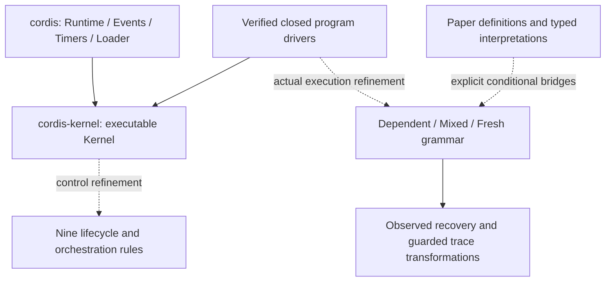

# 架构与源码导航

项目分为可执行验证内核、形式语义与桥接，以及普通 Rust 宿主。它们共享生命周期概念，但证明覆盖范围不同。两个 crate 都来自独立 Rust workspace；原 TLA+ 项目和锁定的 TypeScript 上游是研究参考，不是构建依赖。

虚线表示需要具体合同的证明连接。图中没有从任意宿主 callback 到完整论文语义的已完成箭头。

## 两个 crate

| 部分 | 入口 | 职责与验证边界 |
| --- | --- | --- |
| `cordis-kernel` | [lib.rs](../crates/cordis-kernel/src/lib.rs) | 具体 registry、声明、bindings、generation 与生命周期转换；同一源码经 Verus 和 Cargo 编译 |
| 可逆资源与 episode | [resources.rs](../crates/cordis-kernel/src/resources.rs)、[episode.rs](../crates/cordis-kernel/src/episode.rs)、[ownership.rs](../crates/cordis-kernel/src/ownership.rs) | 实际 inverse、在途准入、Child retirement 与恢复协议 |
| 闭合程序驱动 | [program.rs](../crates/cordis-kernel/src/program.rs)、[mixed_driver.rs](../crates/cordis-kernel/src/mixed_driver.rs)、[fresh_driver.rs](../crates/cordis-kernel/src/fresh_driver.rs) | 拥有 Kernel、程序与真实 journal；构造实际执行历史，不接受调用者伪造执行结果 |
| `cordis` | [lib.rs](../crates/cordis/src/lib.rs)、[runtime.rs](../crates/cordis/src/runtime.rs) | typed services、setup、异步 stage、取消和清理；普通 Rust 适配层 |
| 宿主设施 | [events.rs](../crates/cordis/src/events.rs)、[owned_events.rs](../crates/cordis/src/owned_events.rs)、[timer.rs](../crates/cordis/src/timer.rs) | 事件派发、owner admission/drain、定时器；行为与集成测试 |
| 配置设施 | [loader.rs](../crates/cordis/src/loader.rs)、[config.rs](../crates/cordis/src/config.rs)、[persistence.rs](../crates/cordis/src/persistence.rs) | 配置树、reconciliation、热更新和显式保存；解析、回调与 I/O 仍属宿主边界 |

`ProgramDriver` 使用固定私有 cell 程序；`MixedDriver` 使用混合指令和固定 expected child identity；`FreshDriver` 在真实落地时分配 Child 名称。`admitted_fresh_driver`／`admitted_script` 将单个拥有机器的 admission 与后续调用、落地和释放接为一条历史。具体差异见[程序指南](verified-programs.md)。

闭合驱动的 `Transition` 是按操作区分的枚举：`Step` 必须携带实际 `Outcome`，`Depart` 明确区分 `Divert` 与 `Leave`，actor 只保存一次。规则标签和 fresh child choice 从这些变体构造，避免独立字段组成没有语义的记录。宿主根 setup 也通过枚举保存阶段与 Future 的所有权；异步轮询的 panic 捕获共用内部辅助函数，调度、Pending 保留和清理次序仍由 runtime／事件派发各自控制。

## 生命周期中的关键数据

- **target** 是当前可用 provider 计算出的绑定；**committed** 是 Begin 时保存、贯穿本 episode 的 provider 身份。Active 中 target 暂时改变是允许的中间状态。
- **retire** 表示请求退出，**remove** 才删除 registry 条目。installed consumer 会阻止 provider 提前恢复。
- **parent** 是所有权关系，不是隐式服务依赖。Child inverse 退休捕获的 child，不等待 child 完成卸载；真正 Remove 仍受 parent 与 live-journal 引用约束。
- **receipt / journal** 保存真实调用返回的 inverse 与捕获的名字。清理按 LIFO 执行；失败的部分函数保持 `None`，不能补为恒等来证明恢复。
- **observation** 比较键域与值的可观察行为。它不能自动抹去 parent、freshness 或退休标志对控制规则的影响。

## 证明源码路线

源码保持现有模块布局，以下按证明依赖导航；这些分组不是新的 crate 或隐式可信假设。

| 主题 | 建议入口 | 已建立的连接 |
| --- | --- | --- |
| 效果代数与迭代器 | [foundations.rs](../crates/cordis-kernel/src/foundations.rs)、[iterators.rs](../crates/cordis-kernel/src/iterators.rs)、[quotient.rs](../crates/cordis-kernel/src/quotient.rs) | 实际输入处的 inverse witness、最小 membership、最大观察关系 |
| 依赖类型与严格操作 | [contexts.rs](../crates/cordis-kernel/src/contexts.rs)、[dependent_grammar.rs](../crates/cordis-kernel/src/dependent_grammar.rs)、[partial_independence.rs](../crates/cordis-kernel/src/partial_independence.rs) | 每 key 值域、参数／outcome 族、真实部分函数域、操作独立性 |
| 控制与完整状态 | [refinement.rs](../crates/cordis-kernel/src/refinement.rs)、[semantics.rs](../crates/cordis-kernel/src/semantics.rs)、[preservation.rs](../crates/cordis-kernel/src/preservation.rs) | 九规则、控制投影、表与 auxiliary 字段的安全性 |
| 实际 grammar 历史 | [dependent_lift.rs](../crates/cordis-kernel/src/dependent_lift.rs)、[mixed_grammar.rs](../crates/cordis-kernel/src/mixed_grammar.rs)、[fresh_semantics.rs](../crates/cordis-kernel/src/fresh_semantics.rs) | arbitrary continuation、真实历史来源、Child 和 fresh 分配、空起点前缀安全 |
| 程序到规则 | [program_trace.rs](../crates/cordis-kernel/src/program_trace.rs)、[admitted_script.rs](../crates/cordis-kernel/src/admitted_script.rs) | 从具体成功 API／脚本事件构造同一条合法源轨迹 |
| 混合恢复与删除 | [mixed_foreign_restore.rs](../crates/cordis-kernel/src/mixed_foreign_restore.rs)、[foreign_child_deletion.rs](../crates/cordis-kernel/src/foreign_child_deletion.rs) | 动态 registry、任意年龄 foreign Table／Child journal、合法 surviving execution 及最后 owner 恢复 |
| 交换与有限正常化 | [mixed_orchestration.rs](../crates/cordis-kernel/src/mixed_orchestration.rs)、[causal_normalization.rs](../crates/cordis-kernel/src/causal_normalization.rs)、[rewrite_confluence.rs](../crates/cordis-kernel/src/rewrite_confluence.rs) | 实际局部 diamond、后缀运输、同一源轨迹的 guarded 重写正常形唯一性 |
| 原文通用接口 | [paper_components.rs](../crates/cordis-kernel/src/paper_components.rs)、[paper_instantiation.rs](../crates/cordis-kernel/src/paper_instantiation.rs)、[paper_trace_independence.rs](../crates/cordis-kernel/src/paper_trace_independence.rs) | 原 Component／typed Child／全历史独立性的条件定义；不自动建立递归 Γ 或所有实现的 membership |

新混合删除定理仍要求被删除 owner 使用 Table 指令、保持注册、私有提供项无 foreign consumer，且窗口内部没有 owner Unload。foreign Child 已接入同一恢复归纳；owner Child 和一般调度汇合仍未完成。

## 如何阅读证据

1. 在[覆盖清单](paper-coverage.md)找到条目、状态与证据符号。
2. 阅读该符号的 `requires`／`ensures`，确认对象是具体程序、条件模型还是原文接口。
3. 跟随示例的真实 setup、landing、receipt 和 cleanup；有示例不表示任意宿主都满足前提。
4. 查看[验证说明](validation.md)中的冻结哈希、正向验证、测试及负控状态。开发检查与默认 CI 不含全量负控，不能替代完整 `quality.sh` 的发布门槛。

Verus 的 `--no-cheating` 禁止用 `assume`、`admit`、`external_body` 等绕过证明。求解器接受的合同仍以类型、数学模型和显式前提为边界；它不会自动证明第三方 callback、无限调度公平性、外部副作用或任意 Rust 内存别名。

[论文审计](paper-audit.md)单列 Unit 原文反例与 Child 编码模型障碍。[路线图](roadmap.md)说明这些缺口如何继续，而不是用模块数或验证函数数推断整篇完成。
