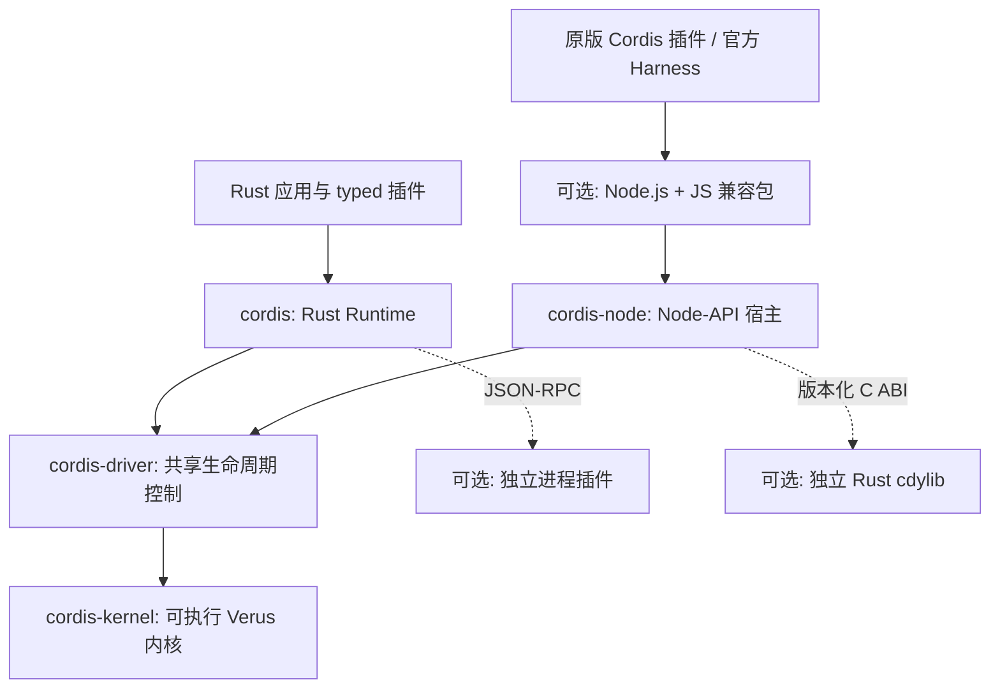
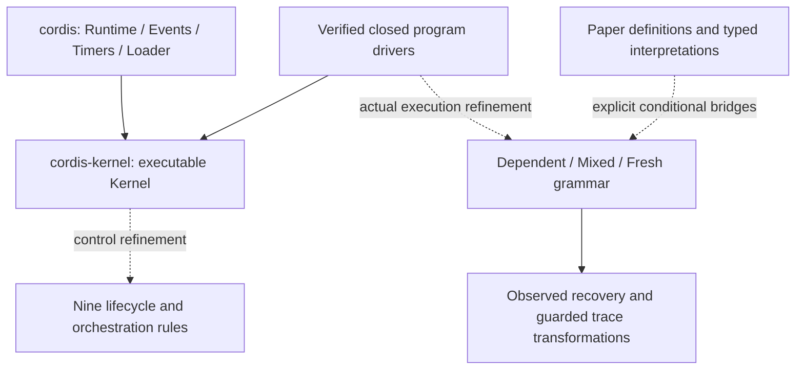

# 架构与源码导航

项目的主线是把形式化方法落实到运行代码，同时对齐 Cordis 功能。论文到代码的审查路径检查生命周期合同；原版插件、上游测试和官方 Harness 工作流检验功能对齐。两类证据互相补充，不能相互替代。

项目分为可执行验证内核、普通 Rust 宿主，以及可选的 Node 兼容宿主。**Rust 应用可以直接使用 `cordis`，不需要 Node.js、npm 或 TypeScript。** Node 层用于运行已有 Cordis 的 JS/TS 插件和 Harness 工作流；它调用同一个 Rust 生命周期内核，不是内核的运行前提。

## 运行架构与可选集成

下图表示运行时调用路径，不是完整的 Cargo 依赖图。虚线是应用按需启用的集成。

五个 crate 位于同一 workspace，但并不要求应用全部采用。依赖关系以各自 `Cargo.toml` 为准：

| 入口 | 实际依赖与适用场景 |
| --- | --- |
| [`cordis`](../crates/cordis/Cargo.toml) | 依赖 `cordis-driver` 和 `cordis-kernel`；提供 typed Rust 插件、服务、异步 stage、事件、定时器和配置设施，没有 Node-API 依赖 |
| [`cordis-driver`](../crates/cordis-driver/Cargo.toml) | 依赖 `cordis-kernel`；让 Rust Runtime 和 Node 宿主共用控制与动作身份协议，宿主适配代码本身是普通 Rust |
| [`cordis-node`](../crates/cordis-node/Cargo.toml) | 依赖 `cordis`、`cordis-driver`、`cordis-plugin-api` 和 Node-API；兼容包保留 JS 对象与语言行为，并驱动 Rust 控制层 |
| [`cordis-plugin-api`](../crates/cordis-plugin-api/Cargo.toml) | 独立 Rust 动态插件 SDK，不依赖 Node 或内核；当前提供的动态库加载器位于 `cordis-node`，使用这条加载与替换路径仍需 Node 宿主 |

Node 兼容层由单独的 crate 和 JS 包组成，不是必须开启的 `cordis` Cargo feature。[workspace 默认成员](../Cargo.toml)只有 `cordis-kernel`、`cordis-driver` 和 `cordis`，不包含 `cordis-node`。纯 Rust 应用中的 typed 插件通常随应用编译；使用 Rust 编写插件本身不意味着需要 C ABI 或 Node。原版 TS 插件需要先编译为 JS，兼容注册入口不是 TS 编译器。

另一条可选路径是 [`ProcessPlugin`](process-plugins.md)：Rust 宿主通过有界 JSON-RPC 启动独立可执行文件。它可以使用其他语言，只需要该插件自身要求的运行环境；协议并不要求 Node，也不能直接把任意原版 Cordis 插件当作进程插件运行。

Rust Runtime 与 Node facade 共用 [`LifecycleDriver`](../crates/cordis-driver/src/shared.rs) 的内核控制和已验证 `LifecycleActions` 协议；值、Future/JS callback 与 backend journal 留在各自宿主。生命周期内核决定可接受的转换，宿主执行 setup、回调与真实资源清理。这种分层让兼容工作集中在语言和宿主边界，同时保留独立的 Rust 使用路径。

`LifecycleActions` 在真实执行路径中检查清理结果和重试票据：失败结果阻止完成卸载，成功结果才允许 Node 路径释放 episode 的依赖。Rust Runtime 和静态 typed 宿主使用经过验证的 `CleanupJournal` 保留失败操作和重试凭据，实际回调载荷由 `CleanupQueue<T>` 与日志一起拥有，验证精确槽位移动与失败载荷保留；显式 `FnMut` 工厂支持新的清理尝试。普通 Rust Runtime 对已消耗的 `FnOnce` 失败使用 `Drained`，不代表所有回调成功；静态 typed 宿主的此类失败继续阻塞。合同和验证边界见[清理协议](cleanup-protocol.zh-CN.md)（[English](cleanup-protocol.md)）。

## 构建、运行与验证的依赖

| 任务 | 所需环境与边界 |
| --- | --- |
| 运行已编译的纯 Rust 应用 | 不需要 Node、npm 或运行 Verus；仍需应用和所选插件自身的系统依赖 |
| 在本仓库构建或修改 Rust 源码 | 使用锁定 Rust 工具链及 Cargo 依赖；内核依赖锁定的 `vstd`。仓库的 `toolchain-env.sh` 还检查已安装的 Verus，详见 [README 快速开始](../README.zh-CN.md#快速开始) |
| 重新检查内核证明 | 使用锁定的 Verus 工具链；`scripts/verify.sh` 对同一内核源码运行 `--no-cheating --compile`，不调用 Node |
| 使用原版插件、官方 Harness 或当前 cdylib 加载器 | 需要 Node、兼容包及 `cordis-node` 原生产物；本地构建该产物还需要 Rust 工具链，详见 [Node 指南](node-compatibility.md) |
| 完整仓库开发与发布验收 | `check-development.sh`、`quality.sh` 包含 Node 构建和兼容测试，因此需要 Node/npm 依赖；发布门槛还包括完整负控，不能用纯 Rust 检查代替 |

锁定 TypeScript 上游是差分测试和官方工作流的参考输入，不是纯 Rust 应用的运行依赖。已有离线缓存时可按 [验证说明](validation.md)运行相应检查；离线参数不负责安装缺失的工具或依赖。

## 形式化连接概览

下面单独展示证明源码的连接。它与上面的运行架构有关联，但一条运行时调用边本身不构成 refinement 证明。

虚线表示需要具体合同的证明连接。图中没有从任意宿主 callback 到完整论文语义的已完成箭头。具体定义、合同、调用点与回归的对应关系见[论文到代码审查指南](paper-review-guide.zh-CN.md)。

## 验证边界与信任前提

| 层次 | 已有保证与证据 | 不由该证据推出的结论 |
| --- | --- | --- |
| 可执行内核 | `cordis-kernel` 的实现同时供 Verus 检查和 Cargo 编译；合同覆盖具体生命周期转换、动作身份、资源协议与 publication primitive | 整个 Rust/JS 应用或任意插件都已被证明正确 |
| 论文模型与闭合驱动 | 对指定模型、实际执行历史和显式 `requires` 建立 `ensures`；部分结果仍要求固定程序、私有 provision、受限调度或条件化的 Component 假设 | 论文所有结论成立、任意回调都满足这些前提，或所有宿主执行都自动对应论文轨迹 |
| 普通 Rust 控制与宿主 | `cordis-driver`、`cordis` 调用内核 API，靠类型、错误处理、行为回归和集成测试检查衔接 | 共享已验证 primitive 就等于这些 crate 及 Future、事件、配置、进程 I/O 已完成形式化验证 |
| Node、FFI 与应用 | 原版插件测试、差分记录、跨语言回归和官方 Harness 工作流提供指定版本与场景的功能证据 | 任意生态插件兼容、C ABI 内存安全证明、无限调度公平性或外部副作用恢复保证 |

验证结论以具体函数合同及其模型为单位。`spec`／`proof` 与可执行部分写在同一内核源码中，避免另写一套未经连接的运行实现；这仍不是对编译后的机器码、Rust 编译器、Verus/求解器或所用库规格本身的验证。它们的正确性以及合同中明确列出的前提构成信任边界。宿主是否满足全部前提需要逐条建立连接，不能用“测试通过”替代这一步。

`--no-cheating` 禁止在验证目标中用 `assume`、`admit`、`external_body` 等绕过合同检查；它不会消除模型假设、宿主边界或工具链信任。当前[覆盖清单](paper-coverage.md)中的 `whole-lifecycle`、`corrected-specification`、`executable-simulation`、`host-boundary` 四项整体义务仍然开放，不能把局部定理数量或应用验收成功解释为整篇论文 refinement 完成。

## Rust crate 与 Node 宿主

| 部分 | 入口 | 职责与验证边界 |
| --- | --- | --- |
| `cordis-kernel` | [lib.rs](../crates/cordis-kernel/src/lib.rs) | 具体 registry、声明、bindings、generation 与生命周期转换；同一源码经 Verus 和 Cargo 编译 |
| 可逆资源与 episode | [resources.rs](../crates/cordis-kernel/src/resources.rs)、[episode.rs](../crates/cordis-kernel/src/episode.rs)、[ownership.rs](../crates/cordis-kernel/src/ownership.rs) | 实际 inverse、在途准入、Child retirement 与恢复协议 |
| 闭合程序驱动 | [program.rs](../crates/cordis-kernel/src/program.rs)、[mixed_driver.rs](../crates/cordis-kernel/src/mixed_driver.rs)、[fresh_driver.rs](../crates/cordis-kernel/src/fresh_driver.rs) | 拥有 Kernel、程序与真实 journal；构造实际执行历史，不接受调用者伪造执行结果 |
| `cordis` | [lib.rs](../crates/cordis/src/lib.rs)、[runtime.rs](../crates/cordis/src/runtime.rs) | typed services、setup、异步 stage、取消和清理；普通 Rust 适配层 |
| `cordis-driver` | [lib.rs](../crates/cordis-driver/src/lib.rs) | 不持 JS 值的 command/action/ticket/lease 驱动；公共控制已接入原 Runtime，宿主协议仍为普通 Rust |
| `cordis-node` + JS facade | [Node 指南](node-compatibility.md) | Node-API、JS 对象表、同图 Rust factory SDK、原版语言层、导入入口；FFI 与 callback 属于宿主边界 |
| `cordis-plugin-api` | [原生模块指南](native-rust-modules.md) | 独立 cdylib authoring、版本化 C ABI、有界 JSON 与 opaque ID；动态库与 FFI 不属于已完成的证明范围 |
| publication | [publication.rs](../crates/cordis-kernel/src/publication.rs) | 独立服务发布身份、lease、撤销与回收；已验证 primitive，尚无完整论文投影 |
| 宿主设施 | [events.rs](../crates/cordis/src/events.rs)、[owned_events.rs](../crates/cordis/src/owned_events.rs)、[timer.rs](../crates/cordis/src/timer.rs) | 事件派发、owner admission/drain、定时器；行为与集成测试 |
| 外部插件 | [process_plugin.rs](../crates/cordis/src/process_plugin.rs) | 有界 JSON-RPC、独立进程、代码快照与变更轮询；操作系统和 I/O 属于宿主边界 |
| 配置设施 | [loader.rs](../crates/cordis/src/loader.rs)、[config.rs](../crates/cordis/src/config.rs)、[persistence.rs](../crates/cordis/src/persistence.rs) | 配置树、reconciliation、热更新和显式保存；解析、回调与 I/O 仍属宿主边界 |

`ProgramDriver` 使用固定私有 cell 程序；`MixedDriver` 使用混合指令和固定 expected child identity；`FreshDriver` 在真实落地时分配 Child 名称。`admitted_fresh_driver`／`admitted_script` 将单个拥有机器的 admission 与后续调用、落地和释放接为一条历史。具体差异见[程序指南](verified-programs.md)。

闭合驱动的 `Transition` 是按操作区分的枚举：`Step` 必须携带实际 `Outcome`，`Depart` 明确区分 `Divert` 与 `Leave`，actor 只保存一次。规则标签和 fresh child choice 从这些变体构造，避免独立字段组成没有语义的记录。宿主根 setup 也通过枚举保存阶段与 Future 的所有权；异步轮询的 panic 捕获共用内部辅助函数，调度、Pending 保留和清理次序仍由 runtime／事件派发各自控制。

## 生命周期中的关键数据

- **target** 是当前可用 provider 计算出的绑定；**committed** 是 Begin 时保存、贯穿本 episode 的 provider 身份。Active 中 target 暂时改变是允许的中间状态。
- **retire** 表示请求退出，**remove** 才删除 registry 条目。installed consumer 会阻止 provider 提前恢复。
- **parent** 是所有权关系，不是隐式服务依赖。Child inverse 退休捕获的 child，不等待 child 完成卸载；真正 Remove 仍受 parent 与 live-journal 引用约束。
- **receipt / journal** 保存真实调用返回的 inverse 与捕获的名字。清理按 LIFO 执行；失败的部分函数保持 `None`，不能补为恒等来证明恢复。
- **observation** 比较键域与值的可观察行为。它不能自动抹去 parent、freshness 或退休标志对控制规则的影响。

原 Rust Runtime 的动态服务使用显式依赖 owner 内部 anchor 的独立 provider 节点。新增 Node 路径及同图 Rust factory SDK 使用真实逻辑 owner 的动态声明与 PublicationRegistry，具体限制见 [Node 指南](node-compatibility.md)。服务读取共享同一 provider 身份的 payload 槽；替换节点产生新的槽，旧消费者不会转读新 provider。原地配置更新先保存补偿计划，事务成功后更新下次启动使用的 recipe，当前 episode 的更新钩子继续持有当前实例状态。外部插件通过独立进程协议执行，代码 revision 保存可执行文件与显式依赖文件的私有快照；这些都是普通 Rust 宿主机制，未扩大内核形式证明范围。

独立 Rust 动态插件复用常驻 Node Driver，ABI 只传有界字节、整数句柄和明确的唤醒函数，不跨库传 `Arc`、trait object、Future 或 `TypeId`。每个 factory ref 绑定不可变代码映像；reload 沿同域队列排空旧实例并重建服务。旧映像保留到进程退出，诊断与预算作用于同一常驻 addon；跨多个独立 addon 的进程资源不共享这个预算。受管根插件可显式迁移有版本的 JSON 业务状态；采集发生在实际排空后、原生 cleanup 前，恢复发生在新 setup 前。跨库对象身份、物理卸载与任意共享动态依赖的版本隔离不在合同内。

## 证明源码路线

源码保持现有模块布局，以下按证明依赖导航；这些分组不是新的 crate 或隐式可信假设。

| 主题 | 建议入口 | 已建立的连接 |
| --- | --- | --- |
| 效果代数与迭代器 | [foundations.rs](../crates/cordis-kernel/src/foundations.rs)、[iterators.rs](../crates/cordis-kernel/src/iterators.rs)、[quotient.rs](../crates/cordis-kernel/src/quotient.rs) | 实际输入处的 inverse witness、最小 membership、最大观察关系 |
| 依赖类型与严格操作 | [contexts.rs](../crates/cordis-kernel/src/contexts.rs)、[dependent_grammar.rs](../crates/cordis-kernel/src/dependent_grammar.rs)、[partial_independence.rs](../crates/cordis-kernel/src/partial_independence.rs) | 每 key 值域、参数／outcome 族、真实部分函数域、操作独立性 |
| 控制与完整状态 | [refinement.rs](../crates/cordis-kernel/src/refinement.rs)、[semantics.rs](../crates/cordis-kernel/src/semantics.rs)、[preservation.rs](../crates/cordis-kernel/src/preservation.rs) | 九规则、控制投影、表与 auxiliary 字段的安全性 |
| 实际 grammar 历史 | [dependent_lift.rs](../crates/cordis-kernel/src/dependent_lift.rs)、[mixed_grammar.rs](../crates/cordis-kernel/src/mixed_grammar.rs)、[fresh_semantics.rs](../crates/cordis-kernel/src/fresh_semantics.rs) | arbitrary continuation、真实历史来源、Child 和 fresh 分配、空起点前缀安全 |
| 程序到规则 | [program_trace.rs](../crates/cordis-kernel/src/program_trace.rs)、[admitted_script.rs](../crates/cordis-kernel/src/admitted_script.rs) | 从具体成功 API／脚本事件构造同一条合法源轨迹 |
| 混合恢复与删除 | [mixed_foreign_restore.rs](../crates/cordis-kernel/src/mixed_foreign_restore.rs)、[foreign_child_deletion.rs](../crates/cordis-kernel/src/foreign_child_deletion.rs) | 动态 registry、任意年龄 foreign Table／Child journal、合法 surviving execution 及最后 owner 恢复 |
| 交换与有限正常化 | [mixed_orchestration.rs](../crates/cordis-kernel/src/mixed_orchestration.rs)、[causal_normalization.rs](../crates/cordis-kernel/src/causal_normalization.rs)、[rewrite_confluence.rs](../crates/cordis-kernel/src/rewrite_confluence.rs) | 实际局部 diamond、后缀运输、同一源轨迹的 guarded 重写正常形唯一性 |
| 原文通用接口 | [paper_components.rs](../crates/cordis-kernel/src/paper_components.rs)、[paper_instantiation.rs](../crates/cordis-kernel/src/paper_instantiation.rs)、[paper_trace_independence.rs](../crates/cordis-kernel/src/paper_trace_independence.rs) | 原 Component／typed Child／全历史独立性的条件定义；不自动建立递归 Γ 或所有实现的 membership |

新混合删除定理仍要求被删除 owner 使用 Table 指令、保持注册、私有提供项无 foreign consumer，且窗口内部没有 owner Unload。foreign Child 已接入同一恢复归纳；owner Child 和一般调度汇合仍未完成。

## 如何阅读证据

1. 在[覆盖清单](paper-coverage.md)找到条目、状态与证据符号。
2. 阅读该符号的 `requires`／`ensures`，确认对象是具体程序、条件模型还是原文接口。
3. 跟随示例的真实 setup、landing、receipt 和 cleanup；有示例不表示任意宿主都满足前提。
4. 查看[验证说明](validation.md)中的冻结哈希、正向验证、测试及负控状态。开发检查与默认 CI 不含全量负控，不能替代完整 `quality.sh` 的发布门槛。

Verus 的 `--no-cheating` 禁止用 `assume`、`admit`、`external_body` 等绕过证明。求解器接受的合同仍以类型、数学模型和显式前提为边界；它不会自动证明第三方 callback、无限调度公平性、外部副作用或任意 Rust 内存别名。

[论文审计](paper-audit.md)单列 Unit 原文反例与 Child 编码模型障碍。[路线图](roadmap.md)说明这些缺口如何继续，而不是用模块数或验证函数数推断整篇完成。
