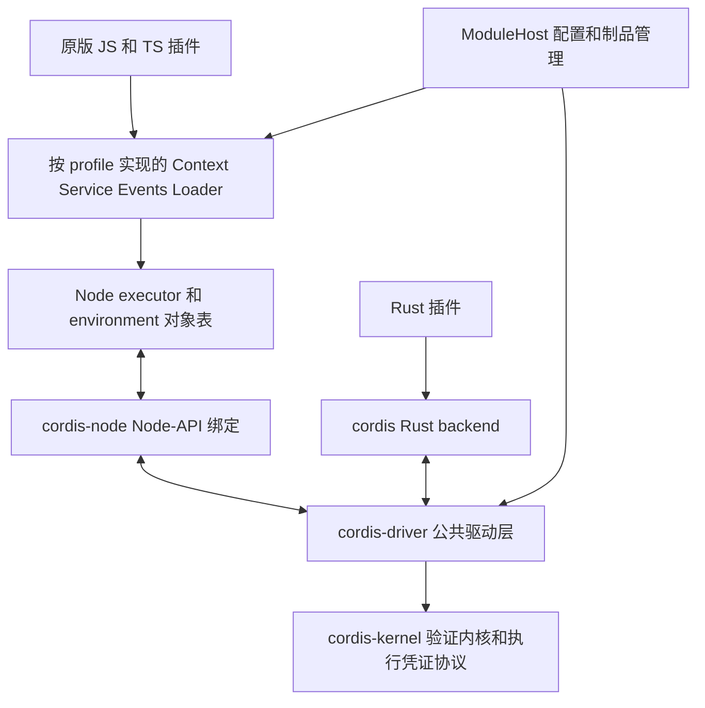
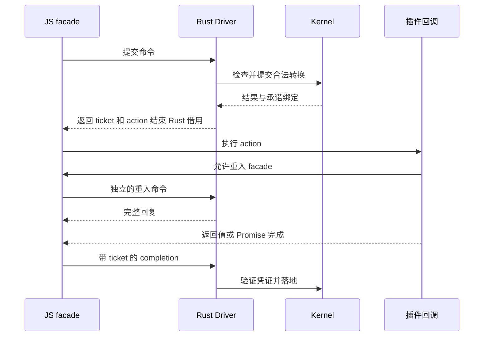

# 原版 Cordis 插件与 Rust 验证内核的长期架构

状态：长期设计，已有实验性原生实现切片。更新：2026-10-05。适用对象：运行时、验证内核、Node 绑定和插件生态的维护者。

本文定义长期目标：在受支持的 Cordis 版本与 API 合同内，不修改插件源码，保留 JavaScript 对象和调用语义，由同一个 Rust 驱动层和 Verus 内核管理 Rust 与 JS 插件的生命周期。Node 提供 JS 执行环境；原版 Fiber 调度器不进入生产执行路径。现有进程插件继续作为外部程序扩展方式，不承担同进程 TS 兼容的核心职责。

本文中的模块、接口和验收编号描述完整目标，不代表每个里程碑已通过。当前实现、命令、差分测试和剩余缺口见 [Node 兼容指南](node-compatibility.md)；M0–M7 已有合同或可运行部分，但均未满足完整验收。现有实现、验证边界分别见 [architecture](architecture.md)、[semantics](semantics.md) 和 [upstream-parity](upstream-parity.md)。本设计不改变论文清单的状态，也不把任意 JS 回调纳入既有证明。

## 目标合同

目标声明应精确为：在锁定的兼容 profile 和版本下，使用已列出合同的原版插件源码可以通过单一 Rust 生命周期内核运行；API 行为兼容、宿主实现测试和形式证明分别提供证据。

必须支持的范围包括函数、对象及类插件；Context、Service、依赖注入和隔离；同步及异步事件；effect 的同步函数、Promise、同步和异步迭代器；配置、Loader、Include；模块解析、代码更新与恢复；实际 Harness 的服务组合。加载原版插件所需的安装配置、启动入口和构建配置可以改变，插件业务源码保持不变。

不能承诺所有历史版本、所有私有 monkey patch 或任意内嵌 Cordis 副本。浏览器 DOM 插件属于另一个宿主目标。原生扩展、任意文件网络操作和非合作 Promise 不会因使用 Cordis 而获得自动恢复保证。与内核安全合同冲突的上游行为必须记录为已知差异，不得放宽内核不变量来隐藏差异。

## 核心决策

| 决策 | 采用的设计 | 原因 |
| --- | --- | --- |
| 生命周期权威 | 每个 runtime domain 只有一个 Rust Driver 和 Kernel | 避免 JS 和 Rust 对同一 fiber 各自解析依赖及卸载 |
| JS 执行 | 完整 Node 环境，通过 Node-API 加载 Rust addon | 保留同步调用、Node 模块和原生插件生态 |
| 驱动复用 | 提取不持服务值、不调用用户代码的公共 driver | Rust 与 Node 宿主共用状态决策，避免复制调度器 |
| JS 对象 | 留在所属 Node environment 的对象表 | 保留对象、闭包、原型和 Promise 身份 |
| 调用语义 | 同步操作保持同步，异步操作保留规定的微任务边界 | 不把 ctx.get、bail 或同步 effect 改为 RPC/Promise |
| 动态服务 | 扩展验证内核，显式建模逻辑提供者和 publication | 当前隐藏 provider 子节点不能直接代表上游可观察身份 |
| 版本兼容 | 一个 domain 固定一个 profile；策略差异显式实现 | 独立 Cordis 与 Harness 并非包名不同的同一实现 |
| 更新协调 | 配置、代码更新和关闭共用一个事务协调器 | 避免 Loader、HMR 与 shutdown 相互交错破坏资源所有权 |
| 证明方式 | 先证明有限协议，再连接宿主执行轨迹 | 不把 JS 计算结果当成无条件正确的证明前提 |

Node 是执行宿主，不是生命周期决策者。Rust 作为 Node 原生模块仍然执行同一份内核代码。JS 插件之间的服务对象留在 Node，不经过 JSON 序列化；当前 Rust/JS SDK 则采用声明过的 JSON DTO、流和对象/回调适配器。对象实体留在定义它的语言中，跨语言方法参数与结果遵守 JSON 合同。

## 模块与依赖方向



| 拟议位置 | 责任 | 禁止承担的责任 |
| --- | --- | --- |
| `crates/cordis-kernel` | Kernel、StageProtocol、publication、凭证和释放守卫的可执行证明 | Node 对象、N-API、任意回调及操作系统 I/O |
| `crates/cordis-driver` | 命令、动作、完成记录、调度策略、生命周期事务和诊断 | 执行插件、持有 JS 值、在锁内调用用户代码 |
| `crates/cordis` | 现有 Rust API、typed payload、Future 和 Rust executor backend | 再实现一套与公共 driver 分离的生命周期策略 |
| `crates/cordis-node` | Node-API 类型转换、environment 校验、driver 调用和唤醒 | 独立解析 provider、决定失败重试、直接绕过内核删除节点 |
| `packages/compat-core` | 可共享的 JS 对象、proxy、callback 和 executor 机制 | 第二套 Fiber 状态机 |
| `packages/compat-cordis` | 独立 Cordis profile 的运行时导出和类型声明 | 默认为其它 profile 提供兼容承诺 |
| `packages/compat-harness` | Harness profile 的导出和可观察行为 | 偷换独立 Cordis 的策略 |
| `packages/compat-loader` | 按 profile 分入口的 Loader、Include、配置持久化适配 | 绕过事务协调器直接更新 native fiber |
| `packages/module-host` | 模块解析、制品代次、HMR 和 provenance | 将清除缓存等同于卸载资源 |
| `packages/launcher` | 受控安装树、引导解析、profile 和 ABI 检查 | 修改用户全局 Node/npm 配置 |
| `tests/compat` | 上游测试、差分运行器、交错场景和安装包验收 | 用通过测试替代证明结论 |

以上是逻辑边界；早期实现可以合并 npm 包，避免在合同稳定前发布过多独立版本。发布 manifest 必须仍能辨认 profile、driver ABI 和内核版本。

## 执行域与线程模型

一个 runtime domain 由一个 Node environment、一个 Driver、一个 Kernel、一个 profile 和其对象表组成。不同 domain 的 JS 对象不能直接互传；跨 Worker 或跨进程必须使用显式桥接。多个独立 Context 是否共享 domain 由引导器明确指定；服务隔离仍由 Context realm 决定。

Node backend 的 driver owner 位于对应事件循环线程。一次 native 调用仅执行有界、不会运行用户代码的命令。CPU 或阻塞 I/O 可以在 Rust worker 中执行；worker 只返回 owned Rust 数据及完成消息，不访问 `napi_value`，不等待 Node 同步反调来取得同步返回值。

同一个应用图中的 Rust 插件通过同一个 Driver 的 Rust backend 挂载。另建一个现有 `Runtime::new()` 会得到另一个图，不能自动共享生命周期。提取完成后，现有 Runtime 是 Driver 加 Rust backend 的便利封装，Node 应用则持有 Driver 加两个 backend。

当前 [runtime.rs](../crates/cordis/src/runtime.rs) 的 payload 是 `Arc<dyn Any + Send + Sync>`，回调与 Future 通常要求 `Send`。JS backend 不满足这套对象约束，不得使用 `unsafe impl Send/Sync` 绕过，也不应为接入 JS 全面移除现有 Rust API 的线程保证。Node-API 的线程限制见[官方文档](https://nodejs.org/api/n-api.html#asynchronous-thread-safe-function-calls)，worker 唤醒可使用 [napi-rs ThreadsafeFunction](https://napi.rs/docs/concepts/threadsafe-function)。

## 当前跨语言接口与资源合同

`cordis-node::plugin` 已提供可由用户 addon 注册的 factory SDK。它通过现有 Node Driver 挂载；既有 `cordis::Plugin` 的静态服务也已通过无图 episode 执行器接入，保留原 typed slot 与 FnMut 定义。完整动态 Runtime 迁移仍未完成，当前范围见 [typed 插件指南](typed-rust-plugins.md)。

| 已实现接口 | 值与调用边界 | 生命周期 |
| --- | --- | --- |
| `Sync` / `Async` 方法 | 声明过的 JSON 参数和结果；Rust 保留 typed 内部状态 | 异步调用各有 job、合作取消与真实 RPC 落地屏障 |
| `Stream` | 定义语言持有 iterator；逐次 pull 传 JSON，无预取 | provider 与 consumer 记录空闲流；关闭等待真实 return/close |
| `Object` | `PluginObject` 或 JS `adaptObject` 固定类型名、方法白名单与 ownership | private brand 和精确 publication/epoch 绑定；borrowed 解除引用，owned 执行可重试析构 |
| callback adapter | factory 方法取得的 only-`call` 对象，使用 `invoke`/`call` | 遵守对象的 ownership 与 action 合同，不是 JSON 内的任意 closure/handle |

JS 持有的 Rust 对象由原 consumer 保留。普通 inverse 全部成功之后，按 acquisition LIFO 释放对象；随后该 Fiber 才清理自己的 Rust sessions，包括剩余 root 对象、backend cleanup 和 release。session 在 setup 被 poll 前登记，覆盖 partial setup。失败的普通 inverse 保留对象和实例以便 retry；某个对象 close 失败时停止并保留更早对象。这个独立晚阶段不宣称对象与普通 effect inverse 之间有全局交错 LIFO。provider 撤销不提前析构对象，正常清理仍等待 committed consumers。

Rust 取得的 `JsObject`/`JsCallback`/`JsStream` 属于单个 action；clone、worker 或实例字段不能提升其 lifetime。主 Future 完成后关闭旧 context 准入，等待已发 acquisition 回复并登记，再由原 action journal 清理。反向对象按真实 acquisition 登记顺序 LIFO 释放。owned/borrowed 混用和重复接管必须拒绝；metadata/getter 异常取得的 owned 资源也须保留可重试清理记录。

业务代码显式 `JsObject.close()` 在方法尚未落地时返回 `ObjectBusy`，显式 `JsStream.close()` 在 pending next 时返回 `StreamBusy`，且不改变准入；这样 clone 不能通过 close 等待自己所在的反向调用链。框架自动清理仍拥有 join 权限：对象先关闭新准入、等待方法/RPC 后才析构，流取消则先发 return 以唤醒 next，再等待二者。JS 中 Rust handle 的 close 保留可观察调用祖先，拒绝等待当前/祖先资源，其他并发 close 加入同次尝试。恢复权限绑定具体 pending request，在真实 reply 后失效，不能仅凭仍活着的 job 或旧 AsyncLocalStorage token 复用。

这些是当前宿主实现合同与测试边界，尚未成为完整的 host refinement。任意句柄参数、跨 environment 身份转移、更多接口/ABI 适配和 typed Runtime 迁移仍需单独设计与验收；具体用法见 [Rust/JS 插件指南](rust-node-plugins.md)。

## 命令与完成协议

下列是内部协议草图，不是现有公开 API。协议采用带类型的枚举，避免字符串操作混淆；ID 在 JS 中用不透明对象或 BigInt 表示，不无检查转换为 Number。

```text
Command:
  ReservePlugin / SealPlugin / RequestDispose / RequestUpdate
  LookupService / PublishService / SetService / RevokeService
  RegisterEffect / RequestEffectCancel / CompleteAction
  StageRevision / CommitRevision / AbortRevision / Drive

Reply:
  Result + HostAction[] + WakeIntent

HostAction:
  InvokeSetup / InvokeEffectStep / InvokeInverse
  EvaluateServiceCheck / ValidateConfig / InvokeConfigUpdate
  EmitLifecycleObservation / ReleaseRoot

ActionTicket:
  DomainId + LogicalFiberId + EpisodeGeneration
  + ActionId + ActionKind + BindingRevision

Completion:
  ActionTicket + NormalizedOutcome + RetainedValueHandles
```

Driver 的所有状态更新在短的 mutable borrow 内完成；返回动作后，结束该 borrow，再由 executor 执行 JS。同步 callback 可以重入新的完整命令。重入命令不能递归推进整个图到静止；只完成同步 API 必需的局部动作，其余推进由单一 pump 驱动。执行外部 JS 前绝不持有 Mutex、RefCell mutable borrow 或跨 FFI 的 Rust `&mut`。

每个 action 先登记所有权，再允许执行；completion 至多被接受一次。重复 completion 的协议处理不得再次执行 disposer；不能释放仍由第一次提交拥有的对象。错误 token、environment 不匹配或新资源句柄冲突返回明确错误并保留可诊断的所有权，不悄悄丢掉资源。



同步 `ctx.effect()` 的同步段必须内联执行；根 plugin setup 按 profile 的 Promise 微任务边界启动。`ctx.plugin()` 必须立即返回可用 thenable Fiber。创建 child 采用 reserve → 安装父所有权和 disposer → 发布观察事件 → seal declarations → 启动 setup 的协议；不同 profile 的事件时序必须显式映射。观察器同步 dispose 或抛错时，child 已有可回收 owner；不得留下孤儿节点。若某上游时序与这一安全条件冲突，保留返回 API，登记精确的时序差异及回归用例。

## 身份与对象所有权

| 身份 | 存放位置及合同 |
| --- | --- |
| DomainId | 标识一个 driver/environment 实例，关闭后不得接受其它实例的句柄 |
| LogicalFiberId | 原版可观察 fiber 身份；与内部实现节点区别明确；不复用 |
| EpisodeGeneration | 每次 activation 的身份，校验托管调用凭证；不等同于 JS Context 对象身份 |
| ActionId / EffectId | 调用或 effect 的凭证；包含所属 episode，不依赖地址 |
| ServiceId | domain 内动态字符串服务名的 interned ID |
| RealmId | JS Symbol 的真实 identity 对应 ID，不能按 description 合并 |
| PublicationId | 一次服务发布的身份，与逻辑提供者及值的版本分离 |
| ValueHandle | environment、slot、generation、kind；JS 表持有实际对象 |
| ModuleGeneration | 实际装载代码、依赖及资源的制品代次 |

JS 对象表保存服务值、函数、配置、迭代器、disposer 和 pending Promise。活跃 episode、已承诺消费者、未完成 action、恢复动作分别持有显式 root；最后一个内部 owner 释放后才删除框架的强引用。GC/finalizer 只用于兜底诊断和内存释放，不承担调用业务 disposer 的正确性。

旧服务对象可以继续被用户代码引用。这符合 JS 对象语义；不得统一使用 revoked Proxy 让任意旧对象读取都失败。必须拒绝的是带旧 episode 执行凭证的新 effect、服务发布或 child 装载等受控操作。用户保留裸对象直接调用产生的外部副作用，不属于框架可完全撤销的能力。

## Context 和服务解析

Context facade 保留原型链、property descriptor、Proxy、特殊属性、Symbol、`extend/isolate/intercept` 和 traceable proxy 缓存。definition site 决定 inject 权限和承诺服务来源，use site 决定调用上下文、拦截配置及效果归属。Context 不能简化为一个 `{ pluginId }`。

原版 Fiber 跨 activation 复用同一个 Context，不能通过对象本身辨认“旧 setup 保存的 ctx”和“新 setup 保存的 ctx”。为保留对象相等语义，facade 保持稳定 Context 身份；框架托管的 setup、effect step、inverse 及显式 tracked task 通过 InvocationTicket 确定 episode。Node AsyncLocalStorage/AsyncResource 可传播托管调用的异步关联，底层授权和 completion 仍必须校验显式 ticket，不能仅靠隐式当前 Context。[Node 异步上下文文档](https://nodejs.org/api/async_context.html)

未登记、失去调用来源的逃逸闭包仅凭共享 ctx 无法自动识别其历史 episode。兼容路径按 profile 的当前 fiber 语义处理，并明确不提供这种调用的过期执行识别保证；需要该保证的代码使用显式 episode capability/受控任务扩展。不能同时承诺完全保留共享 Context 身份，并拒绝所有任意逃逸旧闭包。验收必须包含重启前后 `ctx === oldCtx`、旧受控 action、无 provenance 的旧 closure 和新调用四种情况。

同步 getter 的路径为：JS 解释属性语义 → Rust 校验当前访问身份并返回已承诺 Publication/ValueHandle → JS 返回实际对象或原版语义要求的 traceable view。有托管调用凭证的初始化和清理使用对应 episode 的 committed 绑定，不在每次访问时改用当前 target。普通未托管访问遵循 profile 的当前 Context 语义，不将其描述为已跟踪的旧 episode 访问。

同一域内 JS 服务的函数、闭包、AsyncIterable、AbortSignal 和 Node 原生对象保持 JS 对象形式，不穿过 JSON。Rust 服务的 JS 外观通过明确接口适配：同步方法只调用有界、不会等待 JS 的 native 操作；异步方法返回 Promise；流使用带取消和背压的 AsyncIterator；复杂 Rust 对象使用受控句柄。任意 `Any` 值不自动映射成任意 JS 对象。Rust worker 调用 JS 服务使用异步通道，不能伪装为同步方法。

Service 的 callable、`instanceof`、tracker、mixin、accessor、`this` 和 `Service.extend` 在 JS 实现。Rust 判断服务使用是否合法，JS 实现合法访问后的语言行为。Root 上游允许的 unchecked lookup 单独标识；它不能冒充 kernel 中已登记的 lifecycle consumer。

## 动态 publication 的内核扩展

长期选择是扩展 Kernel 的 publication 模型，而不是把现有 `publish()` 的隐藏 provider child 直接用于 JS。上游依赖 epoch 使用原插件的 uid；隐藏节点会改变 provider identity、通知和重启判断。

拟议模型分离三个概念：逻辑 provider fiber、某次 publication、可变 value slot。`set` 更新同一 publication 的 slot/version，不更换 provider 或 publication，也不自行添加上游没有的 notify。`provide` 创建新的 PublicationId；`revoke` 立即将其从新解析候选中撤下，但保留其已承诺引用和 JS root，直到实际消费者及恢复动作释放。

```text
Publication {
  id, owner: LogicalFiberId, owner_episode: EpisodeGeneration,
  port: (ServiceId, RealmId), slot: ValueSlotId,
  state: Reserved | Visible | Revoked
}
LogicalBinding { port, provider: LogicalFiberId }
ResourceBinding { logical_binding, publication: PublicationId, slot }
```

拟新增 `reserve_publication/publish_publication/replace_slot/revoke_publication` 及 `retain_resource_binding/release_resource_binding/reclaim_publication` 操作。静态 `.provides()` 也通过 reservation 使用同一模型。ID 溢出必须在修改状态之前失败，不回绕复用。

逻辑 target/committed 的 epoch 比较遵循 profile 的原版 provider 身份；PublicationId 不自动加入 epoch 相等判断。另设 publication lease 记录消费者实际捕获的对象。相同 fiber 撤销后重新发布，新的解析可以选中新 publication，旧 episode 仍可能持有旧 publication；不能偷换它的对象，也不能仅因 publication ID 改变就无条件重启消费者。

必须证明及测试：

- 每个 port 在新解析中至多有一个可见 publication。
- 可见性变化不会释放仍被 committed lease 引用的旧 slot。
- 逻辑 owner 的恢复和删除受所有 publication lease 及 child 守卫约束。
- 重复 revoke 幂等，旧句柄不能撤销新 publication。
- `set`、撤销、同 owner 重发布和不同 owner 替换有不同观察合同。
- Loading 期间逻辑 target 从 A 变为不可用再变回 A 的轨迹，不能因为实现细节产生额外重启。

当前 Kernel 固定 declarations 的接口需要修订并重新证明。此项是实现门槛，不是已经完成的 projection。扩展设计应先用上游对照场景确定可观察语义，再固定 spec；现有隐藏节点实现可以暂时保留在 Rust backend，但必须最终通过同一 publication 合同适配。

## Service check 和配置回调

`Service.check`、schema、getter 和配置 merge 都是任意 JS。Rust 不执行它们，也不将其声明为纯函数。Driver 发出带 consumer/provider/publication/value revision 的 action，JS 在正确的 traceable context 中计算，返回结果或异常。

回调返回时检查 publication、slot、context/intercept 和 notification revision。相关状态未变化时接受结果；发生相关重入修改时不得提交旧结果。每个明确 notification 对一个受影响 check 最多执行一次；只有实际的新 notification 才推进下一次检查，不能内部静默循环调用有副作用的 callback。同一 cause 链设有界工作预算，耗尽后报告 `ReentrantAvailabilityCycle` 并停止该链，等待新的外部变更或显式重试，不能伪造 ready。

任意 JS 对象的内部字段修改不能由 revision 自动侦测，仍依赖原版 notify 合同。兼容及相应证明以无循环、最终静止的检查为前提；循环诊断是明确的宿主扩展。回调次数、异常传播和通知顺序仍需在 M2 阶段差分验收，不能先宣称对所有有副作用的 check 完全等价。

配置保留 JS 值和原版 schema 调用，包括非 JSON 对象及 Harness lazy/volatile 表达式。Rust 只接收生命周期相关的规范化声明与不透明配置版本。配置计算与事务提交分开；任意用户回调产生的外部副作用不能因配置事务回滚而自动撤销。

配置变更分为 metadata-only、原地 update hook 和需要重建声明/实例的变更。保留 profile 的 update 返回值和 hook 次序；Rust 现有显式 ConfigUpdatePlan 可作为提供补偿的扩展，但不能假定原版任意 update hook 都可逆。只有登记了可靠补偿的步骤才能宣称事务恢复；否则报告已执行的 hook 与外部副作用边界，必要时按保留 recipe 重建，而不是宣称内存及外部状态原子回滚。

## 生命周期与异步合同

Kernel 的四 phase 与 JS `PENDING/LOADING/ACTIVE/UNLOADING/FAILED/DISPOSED` 通过显式投影关联。失败、退休和删除不是额外的 kernel phase；`uid`、错误、inertia 和状态视图来自 Rust 事实及 profile 投影，不由 JS 独立推导下一步调度。

根初始化及 effect normalization 覆盖 undefined、同步 disposer、Promise、同步 iterable、async iterable、异常和无效返回值。每次迭代 step 先获取 admission；返回的 inverse 进入原 episode journal 后，才可以接受下一步或开始清理。多个独立 effect 组可以并发恢复，每组内部保留规定的逆序，不误改为整个插件只有一个全局 LIFO 栈。

取消停止新的 admission，但不抛弃已经发出的 action。即使期间 dispose/update 或 target 改变，旧 action 返回的 inverse 也必须被原 episode 接收并清理；不能用“generation 已旧”作为丢弃它的理由。只有没有合法 outstanding ticket 的晚到结果才是 stale completion。

provider 从新解析撤下后，已 committed 的消费者仍能在 cleanup 中使用旧服务。只有内核恢复守卫允许、在途 action 已落地、消费者已经释放之后，才运行 provider 的 inverse。cleanup 失败记录为失败，不能作为物理恢复成功的证据；后续清理和句柄释放按明确的错误策略继续。

`fiber.await()` 和 thenable 保留 profile 的 inertia 等待语义；缺少依赖的 Pending 也可能返回。应用需要真正就绪时使用独立的、明确要求必需服务可用的扩展，不修改原 API 的意义。被 dispose 的从未激活节点也不能只看缓存 state，必须结合删除/uid 事实投影。

无限 Promise 没有通用的安全强制取消。超时只能请求合作取消或将域标记为 faulted；在无法取得 inverse 时，不得强行执行正常 `finish_cleanup/remove` 并宣称恢复完成。管理员可以终止进程作为故障处理，其结果是终止而非正常清理证明。JS 异常、Rust panic、native crash 和 environment teardown 分别报告；任何 Rust panic 不得跨越 FFI unwind。

## 事件与任意用户回调

JS 实现原版同步 emit/bail/waterfall、异步 serial/parallel、filter、once/prepend、thisArg 和 continuation。默认事件语义遵循 profile，不能为复用 Rust typed Event 而改变 JS 的返回值判断、快照顺序或微任务时序。

listener 注册和注销的 effect 所有权接入 Driver。普通事件遵循原版在途 handler 合同；若上游不等待某类异步 handler，则不能悄悄把所有 handler 都改成 drain barrier，同时宣称完全等价。另设显式 owned-event/受控操作扩展，为需要更强资源保证的应用登记 invocation/continuation lease，并证明相应 admission/drain 协议。

因此，基础兼容的生命周期证明保护已登记的绑定、effect 和 action，不覆盖任意逃逸的 closure、裸 Promise 或全局 setTimeout。需要更强执行安全的插件必须使用具有相应合同的框架操作。这个边界要在兼容矩阵和证明清单中分别呈现。

## 兼容 profiles

当前研究输入由 [upstream.lock.json](../upstream.lock.json) 固定，以下版本是审阅对象，不是发布支持声明。

| profile | 上游包 | 需要单独表达的策略 |
| --- | --- | --- |
| Cordis | `cordis` 4.0.0-rc.10；loader 1.0.0-rc.7 | 失败锁存、awaitable update、Loader commit，以及公开 API 和导出的 deep imports |
| Harness | `@deepseek-ai/cordis` 4.0.4；loader 1.0.5 | 依赖变化重试、原始配置重新计算、void update、lazy/volatile 配置、内部配置事件和重入清理行为 |

影响状态转换的策略位于 Rust Driver；返回值外形、对象和配置语言差异位于 JS facade。所有 profile 共享 Kernel 安全条件。一个 domain 混用 profiles 默认拒绝，并报告导入链；未来新增跨 profile 合同必须单独测试。profile 的版本更新不自动改变既有运行中的域。

上游存在内部实现差异乃至安全修复，不能把两个版本的观察混成一个所谓“原版语义”。差分测试的参考对象必须是明确 commit。由于加强生命周期安全而产生的时序差异，应保留具体 fixture、理由与影响；不能把失败用例从矩阵删除。

## npm 模块和类型兼容

拟发布 facade 使用项目自己的包名，例如 `@cordis-verus/compat-cordis` 和 `@cordis-verus/compat-harness`。引导器在应用的受控安装树中生成 alias/override 和必要的解析映射，使原插件的 `import 'cordis'` 或 scoped import 指向匹配 facade。不能占用上游 npm 包名，也不能仅修改应用入口而遗漏传递依赖。

解析必须覆盖 ESM、dynamic import、CommonJS、createRequire、conditional exports、项目相对路径、pnpm 嵌套与 symlink，以及被 profile 列出的 deep imports。Node customization hooks 是可用机制之一，具体 API 与最低 Node 版本在 M0 锁定并测试，不能据当前文档推断所有旧 Node 版本都支持。[Node 模块定制文档](https://nodejs.org/api/module.html#customization-hooks)

ESM 和 CJS 外观必须共享同一个 environment 内的构造器、Symbol 和 registry，不产生双包实例。类型声明要保持原包名的 module augmentation、Service 继承及泛型用法；为每个 profile 运行真实 TS 编译用例。

启动时验证可解析的 Cordis 包来源、profile 标记和 ABI。发现受支持安装图中混入原版调度器时拒绝装载并报告路径。静态解析不能可靠识别任意业务 bundle 私自内嵌的实现；这类制品必须外置 Cordis 后重新构建，或列为不支持。任意修改私有调度字段、绕开引导器直接装入另一份 Cordis，不属于已认证部署范围。

TS 开发模式显式选择并锁定转译器和 tsconfig，生产默认使用构建后的 JS。不能依赖 Node 的类型擦除处理所有 TS；它不解释 tsconfig，也不处理 node_modules 中的 TS。[Node TypeScript 文档](https://nodejs.org/api/typescript.html)

## ModuleHost 和 HMR

Loader 负责生态侧配置与模块外观，所有 lifecycle mutation 交给公共协调器。原版 HMR 涉及 module job、namespace、ESM/CJS 缓存、registry identity 和 Loader entry；不能原样加载后假定它只监听文件。

```text
ModuleHost:
  resolve(specifier, parentURL, conditions, profile)
  load(resolvedModule, artifactGeneration)
  dependencyClosure(module)
  prepareReplacement(changedModules)
  activateGeneration(generation)
  retainGeneration(generation)
  releaseGeneration(generation)
```

制品代次包含完整依赖图及锁文件 integrity、profile/ABI、编译选项、JS/source map、native addon 要求、显式资源文件、配置来源和 module provenance。持久化应用数据使用独立路径。外部 watcher 的少量 watch_file 快照不足以代表任意 npm 项目。

更新事务遵循以下流程：

1. 解析、校验和准备候选模块及配置；此时不运行插件 setup。
2. 确定变化项和依赖闭包，保留旧 module generation、factory 和配置。
3. 按现有依赖守卫退休旧实例，允许其消费者完成旧 episode 清理。
4. 用候选 factory 装载新实例，检查所需服务及初始化结果。
5. 候选失败时先取消后续 admission，等待其已发出的 setup/step 落地并登记晚到 inverse，然后清理候选及其拥有的 child；满足资源守卫之后才允许按旧 recipe 重建。
6. 候选成功后提交 entry 到新 fiber 的映射。旧版本清理失败、候选清理失败、旧版本重建失败分别记录为 `OldCleanupFailed`、`CandidateCleanupFailed`、`RestoreFailed`。策略可以继续尝试安全的其余清理，但有未解决资源/失败记录时不返回 clean rollback；需要显式 recover 或异常终止。
7. 没有活跃对象/action/旧 recipe 引用后，释放旧制品。JS 引擎缓存不能释放时，记录其驻留成本并使用域重启控制增长。

准备阶段的模块顶层执行也可能产生外部副作用。检查/隔离进程可以验证语法、解析和部分导出合同，但不能把其中创建的 JS 对象身份搬回目标域，也不能证明真实激活不会失败。禁止把“候选通过检查”描述成无副作用的原子提交。

生产基础能力是可重现的域重启与旧制品恢复。细粒度原地 HMR 是独立能力，使用锁定 Node 版本的 ModuleHost adapter，并承认 native addon、全局副作用或无法刷新模块需要升级为域重启。Node 的 ESM 缓存独立于 require.cache；URL 加查询参数或只删 CJS 缓存都不等价于完整卸载。[Node ESM 文档](https://nodejs.org/api/esm.html#no-requirecache)

完整目标中，配置更新、插件管理、HMR 与 shutdown 使用单一 mutation coordinator，但必须区分两类命令。外部 revision 请求按事务串行；当前 episode 中的 child 创建、effect 登记、服务发布和合法读取按 admission 立即处理，属于当前事务拥有的资源，不能排队等待该事务结束。因此候选 setup 内 `await ctx.plugin(child)` 可以继续推进，回滚也能找到它的 child。

从 setup/cleanup 重入的全局 update/reload 若需要等待当前 action 自己退出，返回明确的 `ReentrantMutation`；同一销毁任务重复请求加入现有任务，但不得允许已知自等待。profile 返回值外形仍保持，必要的错误差异列入矩阵。事务执行上下文携带来源 ticket，不能只用全局布尔锁判断重入。任意 JS Promise 构造的等待环不能普遍检测；只检测框架可观察的等待依赖，其余保持 draining 诊断。

当前实现已将多个 JSON Loader、直接 Fiber 更新/清理和 Context 关闭接入同域 `domainMutation`；内部步骤携带作用域能力，恢复仅允许清理。官方 Include/Group 在 `internal/update` 同步调用栈中发起的子级生命周期操作并入当前事务；精确调用来源与 self/owner/committed-provider 等待检查防止权限逃逸和已知自等待。该权限不跨异步续程。原版 Loader 整条配置持久化事务和模块图 HMR 尚需适配。

恢复期间到来的外部 revision 必须排队、合并或明确拒绝，不能覆盖恢复 journal；恢复所需的 episode-local completion 和 cleanup 命令必须仍能推进。普通服务调用继续遵循各自 admission。

域重启由域外 supervisor 执行。主线程域需要启动新 Node 进程并关闭旧进程；仅在同一 environment 中创建新 Driver 不算重启。Worker 域通过新 Worker 重建，并对不可安全多 environment 使用/卸载的 native addon 拒绝认证或升级为进程重启。同域 Rust 插件也一起重建，旧 JS/Rust 对象身份不跨越这一边界；外部持有者只能重连显式端点。supervisor 只管理进程/Worker 和制品切换，不成为同一域内的第二个 fiber 调度器。

## 关闭和故障处理

正常关闭分为停止新装载/业务 admission、等待已登记 action 落地、按依赖卸载消费者、允许 cleanup 使用 committed 服务、卸载 provider、释放 environment roots、最后关闭 native domain。关闭 API 返回 Promise，重入和重复调用加入同一关闭任务，不重复执行 disposer。

不能在整个关闭期间持有全局 native 锁。cleanup 可以同步或异步调用仍合法的服务，必要的 Node completion pump 持续运行。显式 owned callback 内请求关闭时，必须避免等待包含自己的 drain；将关闭请求和从外部等待完成区分开。

环境关闭 hook 只处理仍可安全触及的 N-API 引用和 Rust 资源；Node 已禁止 JS 执行后不能再尝试用户 cleanup。强制退出、进程崩溃与 addon 崩溃均记录为未确认清理。内核不会证明操作系统或 V8 在崩溃时恢复外部资源。

## 安全与分发边界

同进程插件具有该 Node 进程的能力，此架构不提供恶意插件隔离。不可信插件继续使用独立进程/容器等隔离方式，并通过明确接口桥接；这不会保持任意 JS 对象的透明共享。

Node-API 绑定与其生成代码构成单独审计的 FFI 边界。保持 kernel 不含 unchecked 替代实现，不通过放宽整个 workspace 的安全约束来接入 addon。若绑定生成代码要求隔离 lint/unsafe 边界，需在专用 crate 中明确范围和审计方法。ABI 稳定性不等于 Node、OS、CPU 和 libc 的所有组合都已测试。[Node-API 文档](https://nodejs.org/api/n-api.html)

发布至少包含 Rust crates、匹配的 npm facade/native 包、平台原生制品、types、源码映射、许可证及 provenance。拟先以 Node 24 系列作为支持矩阵候选，最低版本由实际使用 API 和验收结果决定；之前的 Node 22 临时实验不能充当 Node 24 发布证据。Linux/macOS/Windows、x64/arm64 等每个宣称支持的组合必须有实际安装包测试，未测试组合保持未认证。

## 可观测性和性能

诊断按 domain、profile、module generation、logical fiber、episode、action 和 publication 串联。同步抛错保留 JS cause/stack 与 native operation；日志要能区分缺失依赖、初始化失败、等待 promise、被消费者阻挡、恢复失败和 environment 已关闭。任何 ready/settled 状态都不能把 Pending 的缺失依赖隐藏掉。

trace 同时记录 command/action/completion 及 JS 可观察事件，保留相对次序和来源。配置与服务值不默认完整写入日志；性能数据只记录大小、耗时与类型等必要信息。

性能验收与锁定上游基线比较服务 get/call、同步事件、mount/dispose、异步 setup、大图依赖失效和反复 HMR。记录吞吐、尾延迟、native 边界次数、主线程最长工作片段及资源回收后的驻留内存。首阶段测量再确定预算，不预先宣称零开销。

内部可以批量处理确定性纯命令及缓存带 revision 的访问凭证，但不能跳过失效校验或改变同步可观察行为。生命周期 pump 采用每轮工作预算和公平队列，不让大图重算长期阻塞 Node I/O。

## 验证与兼容验收

三种证据分别维护：API/行为对照、宿主实现测试、Verus 证明。每个 profile/version 的矩阵至少记录 `unimplemented`、`implemented`、`upstream-tests-pass`、`differentially-validated` 和 `known-deviation`；形式性质另列证明状态，不将这些状态排成一条混合进度条。

| 验收面 | 必须覆盖 |
| --- | --- |
| 导出与类型 | 原包名 import、ESM/CJS 构造器一致、module augmentation、函数/对象/类插件 |
| Context 与 Service | proxy、shadow/receiver、isolate/intercept、callable、instanceof、accessor/mixin、动态 publication |
| 生命周期 | Pending await、失败重试、setup/effect 微任务边界、重入 child、取消后 inverse 落地、provider cleanup 屏障 |
| 事件 | 同步返回/抛错、snapshot、once、serial/parallel、next 及 profile 的在途合同 |
| Loader 与更新 | Include、配置写回、raw/lazy/volatile 配置、factory identity、HMR 失败恢复和恢复再失败 |
| 真实生态 | 未改源码的上游 Timer/Include 与 Harness tool/provider/session 组合；流和 AbortSignal |
| 分发 | 完整安装目录、npm aliases、传递依赖、条件导出、源码/构建包、native 包和 platform matrix |
| 故障 | panic/throw、非终止 promise、旧 ticket、environment 销毁、重复 cleanup、部分初始化失败 |

差分运行器将同一 fixture 分别运行于锁定上游和 native facade 的独立进程，比较同步返回点、微任务边界、事件次序、对象相等关系、service identity、状态、配置和 cleanup 轨迹。只归一化随机 ID 的一致重命名、路径和时间戳等不稳定信息；不能排序 lifecycle 事件或抹去 Promise 边界来制造相等。允许的并发偏序也需要显式合同。

用受控 Promise gate 制造交错，不靠短 sleep 证明时序。重点包括子插件发布观察器中 dispose parent、Service.check 重入改图、Loading 中撤销后重发布、旧 setup 在更新请求后返回 disposer、cleanup 反调 provider、重复调用 disposer 和多个 module export 共享 callback。

相同 command trace corpus 还应运行于 Rust backend 与 Node backend，检查两者是否遵守同一 Driver 合同。上游业务测试可以作为兼容证据，但仍需独立的对抗场景和负控，避免仅测试我们自己的实现分支。

## 新增证明义务

| 义务 | 目标与前提 |
| --- | --- |
| 身份隔离 | environment、episode、action 和 publication 不混淆；旧执行凭证不能创建新资源；不泛化到无 provenance 的共享 Context |
| action 唯一完成 | 先登记再执行；合法 completion 至多落地一次；取消不丢失 outstanding action |
| inverse 所有权 | 返回 inverse 先登记再 settle；journal token 与宿主 root 对应 |
| publication 生命周期 | 新解析撤销与旧 committed lease 分离；提供者删除晚于最后合法引用 |
| 逻辑解析一致性 | profile 可观察 provider identity 与内核 publication/realm 映射一致 |
| callback 驱动 refinement | 命令及实际完成轨迹映射到 kernel/StageProtocol 的合法转换，不接受调用者伪造历史 |
| profile 策略安全 | 不同失败重试和 update 策略均满足相同 kernel 守卫 |
| 清理与环境终止 | 正常释放满足守卫；abandoned/crashed 与正常完成明确分开 |

JS 回调、schema、N-API 数据转换、Node/V8、操作系统和第三方 native addon 位于相应可信边界。对它们的完整证明不是本设计自动取得的结论。协议模型可以证明“在完成报告真实、对象表遵守所有权等显式前提下”的性质；要扩大结论，必须继续建立绑定实现与该模型的连接。

论文已有反例及开放义务维持原状。新增 Node 宿主不会自动填平一般 recovery、confluence、终止或任意插件行为的证明缺口。

## 交付阶段与退出条件

| 阶段 | 交付物 | 退出条件 |
| --- | --- | --- |
| M0 合同与基线 | 两个 profile manifest、API surface、上游对照运行器、ABI 和 Node 支持候选 | 不改 fixture 即可运行锁定上游；同步/异步与内部 API 差异有清单 |
| M1 公共驱动 | 提取 Driver、Rust backend、action ticket 和资源表协议 | 原有 Rust 行为与 Verus 检查保持通过；新增 action/cancel/重入模型和负控成立 |
| M2 内核扩展 | publication、逻辑身份、lease、check 版本协议、reserve/seal 所有权 | 证明核心不变量；同 owner 重发布和重入 check 的上游差分合同确定 |
| M3 Node 基础宿主 | N-API、对象表、Context/Service/Fiber/Registry、effect normalization | 函数/对象/类插件原样运行；Timer、动态服务、Pending、throw、晚到 inverse 等用例通过 |
| M4 完整核心兼容 | events、traceable/shadow、decorator、schema、profile retry/update | 每个公开合同具有类型测试和差分证据；所有已知差异单独登记 |
| M5 应用与装载 | Loader/Include、模块树、制品和持久化、域重启恢复 | 从真实安装包加载未修改插件；配置更新/代码恢复/缺依赖诊断端到端通过 |
| M6 细粒度更新与 Harness | ModuleHost adapter、HMR、真实 Harness 服务图、Rust/JS JSON/流/对象/回调互通 | 更广生态、typed Runtime 迁移和接口/ABI 合同验收；重入、ownership、流、取消、HMR 场景通过，无法安全热更者准确升级为重启 |
| M7 发布与证明闭合 | 分发矩阵、性能预算、文档、可信边界与正式证据 | 宣称范围逐项有证据；完整发布 gate 和对应负控通过，绑定与协议的未证义务明确列出 |

M1 和 M2 可以在合同明确后交错推进，但 Node 稳定 API 不先于 publication 与重入所有权合同冻结。每个阶段都必须提供可运行垂直切片，避免先堆积 facade 再处理生命周期。用户不要求旧项目升级兼容，因此内部 Rust 接口可以为共同 Driver 重构；仍须以回归证据保护已经实现的语义。

M7 的“发布完成”只针对列出的 profile、API 与平台矩阵。“整篇论文完成”是另一个有独立 ledger 的目标，不能用生态兼容验收替代。

[性能工具](benchmarks.md)现已提供按场景独立进程的测量、原始批次数据、源码/构建绑定和显式 baseline 比较。工具实现不等于实测基线或性能预算已经通过；跨平台预算、长期驻留/泄漏验收、生产负载和上游性能比较仍是独立工作。不能为跑分关闭生命周期守卫。

## 决策验证清单

以下问题已有架构方向，仍需实验决定具体实现细节。它们是阶段退出门槛，不是默许的假设：

- M0：最低 Node 版本、包解析 hook/alias 的具体组合、需要承诺的 deep imports。
- M2：publication 扩展的具体数据结构与证明、Service.check 重入的可观察通知顺序。
- M3：Node 绑定的 reference 生命周期和 panic 隔离；同线程同步重入的无借用执行纪律。
- M4：为遵守内核安全守卫而必须偏离上游的具体例子及用户影响。
- M6：可细粒度刷新模块的条件、不可刷新时的重启策略、跨语言高频调用的性能预算。

## 研究依据

仓库内核和宿主：[Kernel](../crates/cordis-kernel/src/lib.rs)、[StageProtocol](../crates/cordis-kernel/src/episode.rs)、[Runtime](../crates/cordis/src/runtime.rs)、[Owned events](../crates/cordis/src/owned_events.rs)。

独立 Cordis 锁定源码：[Context](https://github.com/cordiverse/cordis/blob/f8ea3cd50f1a5724e8e715995bcde131c9c12b2c/packages/core/src/context.ts)、[Fiber](https://github.com/cordiverse/cordis/blob/f8ea3cd50f1a5724e8e715995bcde131c9c12b2c/packages/core/src/fiber.ts)、[Reflect](https://github.com/cordiverse/cordis/blob/f8ea3cd50f1a5724e8e715995bcde131c9c12b2c/packages/core/src/reflect.ts)、[Registry](https://github.com/cordiverse/cordis/blob/f8ea3cd50f1a5724e8e715995bcde131c9c12b2c/packages/core/src/registry.ts)、[Service](https://github.com/cordiverse/cordis/blob/f8ea3cd50f1a5724e8e715995bcde131c9c12b2c/packages/core/src/service.ts)、[Events](https://github.com/cordiverse/cordis/blob/f8ea3cd50f1a5724e8e715995bcde131c9c12b2c/packages/core/src/events.ts)。

Harness 锁定源码：[Fiber](https://github.com/deepseek-ai/deepseek-harness/blob/da00f7f5358f2949383b35c14f548bc20187d80c/vendor/cordis/src/fiber.ts)、[Loader entry](https://github.com/deepseek-ai/deepseek-harness/blob/da00f7f5358f2949383b35c14f548bc20187d80c/vendor/loader/src/config/entry.ts)、[HMR](https://github.com/deepseek-ai/deepseek-harness/blob/da00f7f5358f2949383b35c14f548bc20187d80c/packages/boot/hmr/src/index.ts)、[重入生命周期用例](https://github.com/deepseek-ai/deepseek-harness/blob/da00f7f5358f2949383b35c14f548bc20187d80c/packages/extensions/tool-cordis/tests/cordis-lifecycle.spec.ts)。

前一轮临时实验使用未修改源码的 core 与 TimerService，验证了 Node 下原版行为及 Pending await 细节；它没有使用本 RFC 的 Rust-backed facade，因此不计入本架构实现验收。设计审阅、静态文档检查和任何新运行证据必须分开记录。
